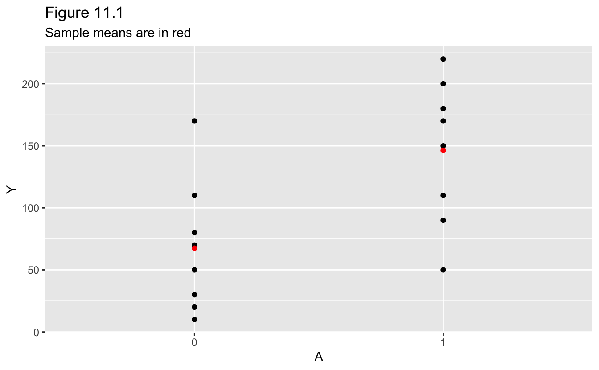
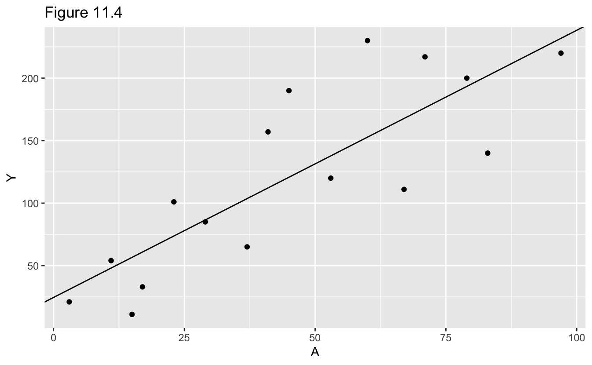

# 11 Why Model? {-}


```r
# Packages
library(tidyverse)

# Round and format vector
round_format <- function(x, nsmall = 2, ...) {
  format(round(x, digits = nsmall), nsmall = nsmall, ...)
}
# Print tibble
kable <- function(x, cols = where(is.double), nsmall = 2, align = "r", ...) {
  x %>%
    mutate(across({{cols}}, round_format, nsmall = nsmall)) %>%
    knitr::kable(align = align, ...) %>% 
    kableExtra::kable_styling(full_width = FALSE, position = "left")
}
```

## 11.1 Data cannot speak for themselves {-}

Dataset 1.


```r
data_1 <- 
  tibble(
    A = as.factor(c(1, 1, 1, 1, 1, 1, 1, 1, 0, 0, 0, 0, 0, 0, 0, 0)),
    Y = 
      c(200, 150, 220, 110, 50, 180, 90, 170, 170, 30, 70, 110, 80, 50, 10, 20)
  )
```

Figure 11.1.


```r
data_1_means <- 
  data_1 %>% 
  group_by(A) %>% 
  summarize(Y = mean(Y))

data_1 %>% 
  ggplot(aes(A, Y)) +
  geom_point() +
  geom_point(data = data_1_means, color = "red") +
  labs(
    title = "Figure 11.1",
    subtitle = "Sample means are in red"
  )
```



Sample means for levels of A.


```r
kable(data_1_means)
```

<table class="table" style="width: auto !important; ">
 <thead>
  <tr>
   <th style="text-align:right;"> A </th>
   <th style="text-align:right;"> Y </th>
  </tr>
 </thead>
<tbody>
  <tr>
   <td style="text-align:right;"> 0 </td>
   <td style="text-align:right;"> 67.50 </td>
  </tr>
  <tr>
   <td style="text-align:right;"> 1 </td>
   <td style="text-align:right;"> 146.25 </td>
  </tr>
</tbody>
</table>

Dataset 2.


```r
data_2 <- 
  tibble(
    A = as.factor(c(1, 1, 1, 1, 2, 2, 2, 2, 3, 3, 3, 3, 4, 4, 4, 4)),
    Y = 
      c(110, 80, 50, 40, 170, 30, 70, 50, 110, 50, 180, 130, 200, 150, 220, 210)
  )
```

Figure 11.2.


```r
data_2_means <- 
  data_2 %>% 
  group_by(A) %>% 
  summarize(Y = mean(Y))

data_2 %>% 
  ggplot(aes(A, Y)) +
  geom_point() +
  geom_point(data = data_2_means, color = "red") +
  labs(
    title = "Figure 11.2",
    subtitle = "Sample means are in red"
  )
```


Sample means for levels of A.


```r
kable(data_2_means, nsmall = 1)
```

<table class="table" style="width: auto !important; ">
 <thead>
  <tr>
   <th style="text-align:right;"> A </th>
   <th style="text-align:right;"> Y </th>
  </tr>
 </thead>
<tbody>
  <tr>
   <td style="text-align:right;"> 1 </td>
   <td style="text-align:right;"> 70.0 </td>
  </tr>
  <tr>
   <td style="text-align:right;"> 2 </td>
   <td style="text-align:right;"> 80.0 </td>
  </tr>
  <tr>
   <td style="text-align:right;"> 3 </td>
   <td style="text-align:right;"> 117.5 </td>
  </tr>
  <tr>
   <td style="text-align:right;"> 4 </td>
   <td style="text-align:right;"> 195.0 </td>
  </tr>
</tbody>
</table>

Dataset 3.


```r
data_3 <- 
  tibble(
    A = c(3, 11, 17, 23, 29, 37, 41, 53, 67, 79, 83, 97, 60, 71, 15, 45),
    Y = 
      c(
        21, 54, 33, 101, 85, 65, 157, 120, 111, 200, 140, 220, 230, 217, 11, 190
      )
  )
```

Figure 11.3.


```r
data_3 %>% 
  ggplot(aes(A, Y)) +
  geom_point() +
  labs(title = "Figure 11.3")
```


## 11.2 Parametric estimators of the conditional mean {-}

Fit linear regression.


```r
fit <- lm(Y ~ A, data = data_3)

broom::tidy(fit, conf.int = TRUE) %>% 
  select(term, estimate, conf_low = conf.low, conf_high = conf.high) %>% 
  kable(align = "lrrr")
```

<table class="table" style="width: auto !important; ">
 <thead>
  <tr>
   <th style="text-align:left;"> term </th>
   <th style="text-align:right;"> estimate </th>
   <th style="text-align:right;"> conf_low </th>
   <th style="text-align:right;"> conf_high </th>
  </tr>
 </thead>
<tbody>
  <tr>
   <td style="text-align:left;"> (Intercept) </td>
   <td style="text-align:right;"> 24.55 </td>
   <td style="text-align:right;"> -21.20 </td>
   <td style="text-align:right;"> 70.29 </td>
  </tr>
  <tr>
   <td style="text-align:left;"> A </td>
   <td style="text-align:right;"> 2.14 </td>
   <td style="text-align:right;"> 1.28 </td>
   <td style="text-align:right;"> 2.99 </td>
  </tr>
</tbody>
</table>

Figure 11.4.


```r
data_3 %>% 
  ggplot(aes(A, Y)) +
  geom_point() +
  geom_abline(slope = coef(fit)["A"], intercept = coef(fit)["(Intercept)"]) +
  labs(title = "Figure 11.4")
```



Predicted value of E[Y | A = 90] with 95% confidence interval.


```r
predict(fit, newdata = tibble(A = 90), interval = "confidence") %>% 
  as_tibble() %>% 
  rename(estimate = fit, conf_low = lwr, conf_high = upr) %>% 
  kable(nsmall = 1)
```

<table class="table" style="width: auto !important; ">
 <thead>
  <tr>
   <th style="text-align:right;"> estimate </th>
   <th style="text-align:right;"> conf_low </th>
   <th style="text-align:right;"> conf_high </th>
  </tr>
 </thead>
<tbody>
  <tr>
   <td style="text-align:right;"> 216.9 </td>
   <td style="text-align:right;"> 172.1 </td>
   <td style="text-align:right;"> 261.6 </td>
  </tr>
</tbody>
</table>

## 11.3 Nonparametric estimators of the conditional mean {-}

Fit linear regression.


```r
fit <- lm(Y ~ A, data = data_1)

broom::tidy(fit) %>% 
  select(term, estimate) %>% 
  kable(align = "lr")
```

<table class="table" style="width: auto !important; ">
 <thead>
  <tr>
   <th style="text-align:left;"> term </th>
   <th style="text-align:right;"> estimate </th>
  </tr>
 </thead>
<tbody>
  <tr>
   <td style="text-align:left;"> (Intercept) </td>
   <td style="text-align:right;"> 67.50 </td>
  </tr>
  <tr>
   <td style="text-align:left;"> A1 </td>
   <td style="text-align:right;"> 78.75 </td>
  </tr>
</tbody>
</table>

Estimates of E[Y | A] for A = 0 and A = 1.


```r
tibble(
  A = as.factor(0:1),
  Y = predict(fit, newdata = tibble(A))
) %>% 
  kable()
```

<table class="table" style="width: auto !important; ">
 <thead>
  <tr>
   <th style="text-align:right;"> A </th>
   <th style="text-align:right;"> Y </th>
  </tr>
 </thead>
<tbody>
  <tr>
   <td style="text-align:right;"> 0 </td>
   <td style="text-align:right;"> 67.50 </td>
  </tr>
  <tr>
   <td style="text-align:right;"> 1 </td>
   <td style="text-align:right;"> 146.25 </td>
  </tr>
</tbody>
</table>

## 11.4 Smoothing {-}

Fit linear regression with quadratic term.


```r
fit <- lm(Y ~ A + I(A^2), data = data_3)

broom::tidy(fit) %>% 
  select(term, estimate) %>% 
  kable(align = "lr")
```

<table class="table" style="width: auto !important; ">
 <thead>
  <tr>
   <th style="text-align:left;"> term </th>
   <th style="text-align:right;"> estimate </th>
  </tr>
 </thead>
<tbody>
  <tr>
   <td style="text-align:left;"> (Intercept) </td>
   <td style="text-align:right;"> -7.41 </td>
  </tr>
  <tr>
   <td style="text-align:left;"> A </td>
   <td style="text-align:right;"> 4.11 </td>
  </tr>
  <tr>
   <td style="text-align:left;"> I(A^2) </td>
   <td style="text-align:right;"> -0.02 </td>
  </tr>
</tbody>
</table>

Figure 11.5.


```r
line <- 
  tibble(
    A = seq(min(data_3$A), max(data_3$A), length.out = 201),
    Y = predict(fit, newdata = tibble(A))
  )

data_3 %>% 
  ggplot(aes(A, Y)) +
  geom_point() +
  geom_line(data = line) +
  labs(title = "Figure 11.5")
```


Predicted value of E[Y | A = 90] with 95% confidence interval.


```r
predict(fit, newdata = tibble(A = 90), interval = "confidence") %>% 
  as_tibble() %>% 
  rename(estimate = fit, conf_low = lwr, conf_high = upr) %>% 
  kable(nsmall = 1)
```

<table class="table" style="width: auto !important; ">
 <thead>
  <tr>
   <th style="text-align:right;"> estimate </th>
   <th style="text-align:right;"> conf_low </th>
   <th style="text-align:right;"> conf_high </th>
  </tr>
 </thead>
<tbody>
  <tr>
   <td style="text-align:right;"> 197.1 </td>
   <td style="text-align:right;"> 142.8 </td>
   <td style="text-align:right;"> 251.5 </td>
  </tr>
</tbody>
</table>

