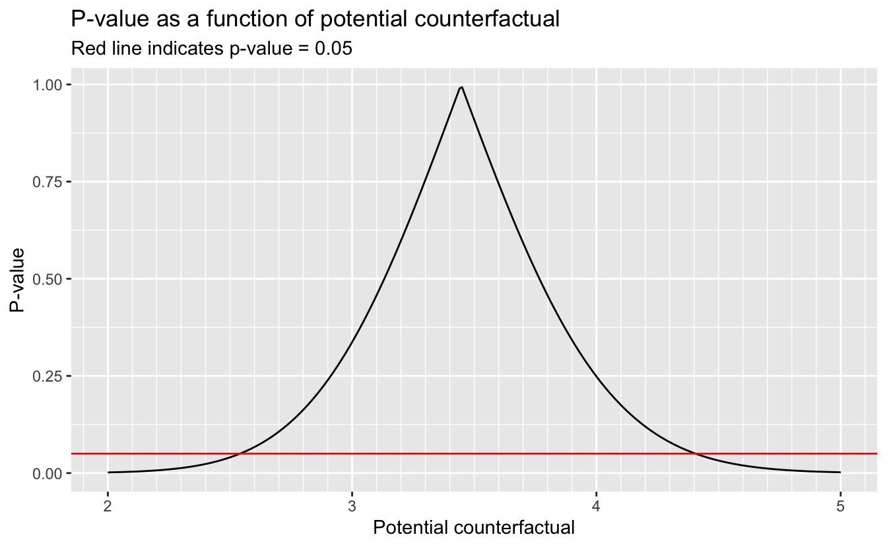

# 14 G-estimation and structural nested models {-}


```r
# Packages
library(tidyverse)

# Parameters
  # NHEFS data
file_nhefs <- here::here("data/nhefs.rds")

# Round and format vector
round_format <- function(x, nsmall = 2, ...) {
  format(round(x, digits = nsmall), nsmall = nsmall, ...)
}
# Print tibble
kable <- function(x, cols = where(is.double), nsmall = 2, align = "r", ...) {
  x %>%
    mutate(across({{cols}}, round_format, nsmall = nsmall)) %>%
    knitr::kable(align = align, ...) %>% 
    kableExtra::kable_styling(full_width = FALSE, position = "left")
}
# Print min, mean, and max of vector
kable_summary <- function(x, nsmall = 2, ...) {
  tibble(min = min(x), mean = mean(x), max = max(x)) %>%
    kable(nsmall = nsmall, ...)
}

#===============================================================================

# NHEFS data
nhefs <- read_rds(file_nhefs)

# NHEFS censored for those with weight measurements in 1982
nhefs_censored <- 
  nhefs %>% 
  drop_na(wt82, wt82_71)
```

## 14.1 The causal question revisited {-}

Number of people in censored dataset.


```r
nrow(nhefs_censored)
```

```
#> [1] 1566
```

Range of ages.


```r
range(nhefs_censored$age)
```

```
#> [1] 25 74
```

## 14.4 Rank preservation {-}

Individuals ranked first, second, and last in weight gain.


```r
nhefs_censored %>% 
  select(seqn, wt82_71) %>%
  arrange(desc(wt82_71)) %>% 
  slice(1:2, n()) %>% 
  kable(nsmall = 1)
```

<table class="table" style="width: auto !important; ">
 <thead>
  <tr>
   <th style="text-align:right;"> seqn </th>
   <th style="text-align:right;"> wt82_71 </th>
  </tr>
 </thead>
<tbody>
  <tr>
   <td style="text-align:right;"> 23522 </td>
   <td style="text-align:right;"> 48.5 </td>
  </tr>
  <tr>
   <td style="text-align:right;"> 6928 </td>
   <td style="text-align:right;"> 47.5 </td>
  </tr>
  <tr>
   <td style="text-align:right;"> 23321 </td>
   <td style="text-align:right;"> -41.3 </td>
  </tr>
</tbody>
</table>

## 14.5 G-estimation {-}

Add `censored` variable to `nhefs` to indicate whether or not weight in 1982 (`wt82`) is missing.


```r
nhefs <- 
  nhefs %>% 
  mutate(censored = if_else(!is.na(wt82), 0, 1) %>% as.factor())
```

Non-stabilized IP weights for censoring.


```r
fit <- 
  glm(
    censored ~ qsmk + sex + poly(age, 2) + race + education + poly(wt71, 2) +
      poly(smokeintensity, 2) + poly(smokeyrs, 2) + active + exercise,
    family = binomial(),
    data = nhefs
  )

ip_w_c <- 
  case_when(
    nhefs$censored == "0" ~ 1 / (1 - predict(fit, type = "response")),
    nhefs$censored == "1" ~ 1 / predict(fit, type = "response"),
    TRUE ~ NA_real_
  ) %>% 
  keep(nhefs$censored == "0")

kable_summary(ip_w_c)
```

<table class="table" style="width: auto !important; ">
 <thead>
  <tr>
   <th style="text-align:right;"> min </th>
   <th style="text-align:right;"> mean </th>
   <th style="text-align:right;"> max </th>
  </tr>
 </thead>
<tbody>
  <tr>
   <td style="text-align:right;"> 1.00 </td>
   <td style="text-align:right;"> 1.04 </td>
   <td style="text-align:right;"> 1.82 </td>
  </tr>
</tbody>
</table>

For potential counterfactual (`psi`), calculate logistic regression coefficient (`alpha`) and its p-value (`p_value`).


```r
g_est <- function(psi) {
  geepack::geeglm(
    qsmk ~ sex + poly(age, 2) + race + education + poly(wt71, 2) + 
      poly(smokeintensity, 2) + poly(smokeyrs, 2) + active + exercise + h,
    family = binomial(),
    data = 
      nhefs_censored %>% 
      mutate(
        qsmk = as.double(qsmk) - 1,
        h = wt82_71 - psi * qsmk
      ),
    weights = ip_w_c,
    id = seqn
  ) %>% 
    broom::tidy() %>% 
    filter(term == "h") %>% 
    transmute(psi, alpha = estimate, p_value = p.value)
}
```

Calculate `alpha` for potential counterfactuals between 2.0 and 5.0 in increments of 0.1.


```r
v <- 
  seq(2, 5, 0.1) %>% 
  map_dfr(g_est)

v
```

```
#> # A tibble: 31 × 3
#>      psi  alpha p_value
#>    <dbl>  <dbl>   <dbl>
#>  1   2   0.0267 0.00177
#>  2   2.1 0.0249 0.00358
#>  3   2.2 0.0231 0.00696
#>  4   2.3 0.0212 0.0130 
#>  5   2.4 0.0194 0.0234 
#>  6   2.5 0.0176 0.0404 
#>  7   2.6 0.0157 0.0670 
#>  8   2.7 0.0139 0.107  
#>  9   2.8 0.0120 0.163  
#> 10   2.9 0.0102 0.239  
#> # … with 21 more rows
#> # ℹ Use `print(n = ...)` to see more rows
```

The two values of `psi` with `alpha` values closest to 0.


```r
v %>% 
  select(psi, alpha) %>% 
  slice_min(n = 2, abs(alpha)) %>% 
  knitr::kable(digits = 3) %>% 
  kableExtra::kable_styling(full_width = FALSE, position = "left")
```

<table class="table" style="width: auto !important; ">
 <thead>
  <tr>
   <th style="text-align:right;"> psi </th>
   <th style="text-align:right;"> alpha </th>
  </tr>
 </thead>
<tbody>
  <tr>
   <td style="text-align:right;"> 3.4 </td>
   <td style="text-align:right;"> 0.001 </td>
  </tr>
  <tr>
   <td style="text-align:right;"> 3.5 </td>
   <td style="text-align:right;"> -0.001 </td>
  </tr>
</tbody>
</table>

Estimate of ATE with 95% confidence interval.


```r
v %>% 
  summarize(
    estimate = min(psi[abs(alpha) == min(abs(alpha))]),
    conf_low = max(psi[psi < estimate & p_value < 0.05]),
    conf_high = min(psi[psi > estimate & p_value < 0.05])
  ) %>% 
  kable(nsmall = 1)
```

<table class="table" style="width: auto !important; ">
 <thead>
  <tr>
   <th style="text-align:right;"> estimate </th>
   <th style="text-align:right;"> conf_low </th>
   <th style="text-align:right;"> conf_high </th>
  </tr>
 </thead>
<tbody>
  <tr>
   <td style="text-align:right;"> 3.4 </td>
   <td style="text-align:right;"> 2.5 </td>
   <td style="text-align:right;"> 4.5 </td>
  </tr>
</tbody>
</table>

P-value as a function of potential counterfactual.


```r
v <- 
  seq(2, 5, 0.01) %>% 
  map_dfr(g_est)

v %>% 
  ggplot(aes(psi, p_value)) +
  geom_line() +
  geom_hline(yintercept = 0.05, color = "red") +
  scale_x_continuous(minor_breaks = scales::breaks_width(0.1)) +
  labs(
    title = "P-value as a function of potential counterfactual",
    subtitle = "Red line indicates p-value = 0.05",
    x = "Potential counterfactual",
    y = "P-value"
  )
```



For a better estimate of the ATE, use optimization to search for the value of `psi` with `alpha` value closest to 0.


```r
f <- function(psi) {
  abs(g_est(psi)$alpha)
}

v <- optimize(f, interval = c(3.4, 3.5))

estimate <- v$minimum
tibble(estimate, `abs(alpha)` = v$objective) %>% 
  kable(nsmall = 3)
```

<table class="table" style="width: auto !important; ">
 <thead>
  <tr>
   <th style="text-align:right;"> estimate </th>
   <th style="text-align:right;"> abs(alpha) </th>
  </tr>
 </thead>
<tbody>
  <tr>
   <td style="text-align:right;"> 3.446 </td>
   <td style="text-align:right;"> 0.000 </td>
  </tr>
</tbody>
</table>

For a better estimate of the lower bound of the 95% confidence interval, use optimization to search for the smaller value of `psi` with p-value value closest to 0.05.


```r
f <- function(psi) {
  abs(g_est(psi)$p_value - 0.05)
}

v <- optimize(f, interval = c(2.5, 2.6))

conf_low <- v$minimum
tibble(conf_low, `abs(p_value - 0.05)` = v$objective) %>% 
  kable(nsmall = 3)
```

<table class="table" style="width: auto !important; ">
 <thead>
  <tr>
   <th style="text-align:right;"> conf_low </th>
   <th style="text-align:right;"> abs(p_value - 0.05) </th>
  </tr>
 </thead>
<tbody>
  <tr>
   <td style="text-align:right;"> 2.541 </td>
   <td style="text-align:right;"> 0.000 </td>
  </tr>
</tbody>
</table>

For a better estimate of the upper bound of the 95% confidence interval, use optimization to search for the larger value of `psi` with p-value value closest to 0.05.


```r
v <- optimize(f, interval = c(4.4, 4.5))

conf_high <- v$minimum
tibble(conf_high, `abs(p_value - 0.05)` = v$objective) %>% 
  kable(nsmall = 3)
```

<table class="table" style="width: auto !important; ">
 <thead>
  <tr>
   <th style="text-align:right;"> conf_high </th>
   <th style="text-align:right;"> abs(p_value - 0.05) </th>
  </tr>
 </thead>
<tbody>
  <tr>
   <td style="text-align:right;"> 4.406 </td>
   <td style="text-align:right;"> 0.000 </td>
  </tr>
</tbody>
</table>

Using the formula in Technical Point 14.2, we obtain a closed-form estimate of the ATE. 


```r
fit <- 
  glm(
    qsmk ~ sex + poly(age, 2) + race + education + poly(wt71, 2) +
      poly(smokeintensity, 2) + poly(smokeyrs, 2) + active + exercise,
    family = binomial(),
    data = nhefs_censored,
    weights = ip_w_c
  )

broom::tidy(fit)
```

```
#> # A tibble: 19 × 5
#>    term           estimate std.error statistic       p.value
#>    <chr>             <dbl>     <dbl>     <dbl>         <dbl>
#>  1 (Intercept)     -1.17       0.199    -5.85  0.00000000490
#>  2 sex1            -0.514      0.150    -3.42  0.000622     
#>  3 poly(age, 2)1   22.1        4.77      4.64  0.00000348   
#>  4 poly(age, 2)2   -4.51       3.05     -1.48  0.140        
#>  5 race1           -0.861      0.206    -4.18  0.0000293    
#>  6 education2      -0.0289     0.193    -0.150 0.881        
#>  7 education3       0.0877     0.173     0.507 0.612        
#>  8 education4       0.0664     0.266     0.249 0.803        
#>  9 education5       0.471      0.221     2.13  0.0331       
#> 10 poly(wt71, 2)1   3.43       2.59      1.33  0.185        
#> # … with 9 more rows
#> # ℹ Use `print(n = ...)` to see more rows
```

```r
v <- 
  nhefs_censored %>% 
  mutate(
    qsmk = as.double(qsmk) - 1,
    qsmk_pred = predict(fit, type = "response"),
  ) %>% 
  summarize(
    estimate = 
      sum(ip_w_c * wt82_71 * (qsmk - qsmk_pred)) / 
      sum(ip_w_c * qsmk * (qsmk - qsmk_pred))
  )

kable(v, nsmall = 3)
```

<table class="table" style="width: auto !important; ">
 <thead>
  <tr>
   <th style="text-align:right;"> estimate </th>
  </tr>
 </thead>
<tbody>
  <tr>
   <td style="text-align:right;"> 3.446 </td>
  </tr>
</tbody>
</table>


## 14.6 Structural nested models with two or more parameters {-}

The estimate for the ATE if we assume that it depends upon the baseline level of smoking intensity (`smokeintensity`).


```r
v <- 
  nhefs_censored %>% 
  mutate(
    qsmk = as.double(qsmk) - 1,
    qsmk_pred = predict(fit, type = "response"),
    a_1 = ip_w_c * qsmk * (qsmk - qsmk_pred),
    a_2 = a_1 * smokeintensity,
    a_3 = a_1 * smokeintensity^2,
    b_1 = ip_w_c * wt82_71 * (qsmk - qsmk_pred),
    b_2 = b_1 * smokeintensity
  ) %>% 
  summarize(across(starts_with(c("a_", "b_")), sum))

a <- matrix(c(v$a_1, v$a_2, v$a_2, v$a_3), nrow = 2)
b <- matrix(c(v$b_1, v$b_2), nrow = 2)
v <- solve(a, b)

tibble(psi_1 = v[1, 1], psi_2 = v[2, 1]) %>% 
  kable()
```

<table class="table" style="width: auto !important; ">
 <thead>
  <tr>
   <th style="text-align:right;"> psi_1 </th>
   <th style="text-align:right;"> psi_2 </th>
  </tr>
 </thead>
<tbody>
  <tr>
   <td style="text-align:right;"> 2.86 </td>
   <td style="text-align:right;"> 0.03 </td>
  </tr>
</tbody>
</table>

