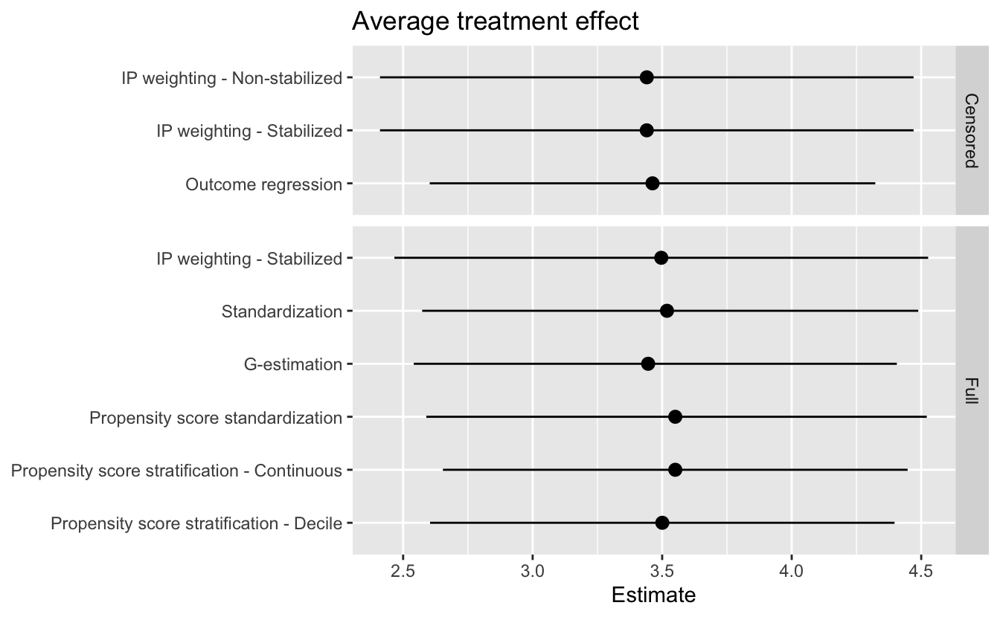

# Results {-}


```r
# Packages
library(tidyverse)

# Parameters
  # Average treatment effect results
file_ate <- here::here("data/ate.rds")

# Round and format vector
round_format <- function(x, nsmall = 2, ...) {
  format(round(x, digits = nsmall), nsmall = nsmall, ...)
}
# Print tibble
kable <- function(x, cols = where(is.double), nsmall = 2, align = "r", ...) {
  x %>%
    mutate(across({{cols}}, round_format, nsmall = nsmall)) %>%
    knitr::kable(align = align, ...) %>% 
    kableExtra::kable_styling(full_width = FALSE, position = "left")
}

#===============================================================================

# Average treatment effect results
ate <- 
  read_rds(file_ate) %>% 
  arrange(dataset, section, method)
```

## Average treatment effect {-}

Chapters 12-15 calculated the average causal effect of smoking cessation (`qsmk`) on weight gain (`wt82_71`) using nine different methods. Here we will compare the results. We will separate the methods into two groups. The first group (Censored) used only the censored data, that is the data where `wt82_71` was not `NA`. The second group used the full dataset (Full).

Here are the results.


```r
ate %>% 
  kable(align = "rllrrr")
```

<table class="table" style="width: auto !important; ">
 <thead>
  <tr>
   <th style="text-align:right;"> section </th>
   <th style="text-align:left;"> method </th>
   <th style="text-align:left;"> dataset </th>
   <th style="text-align:right;"> estimate </th>
   <th style="text-align:right;"> conf_low </th>
   <th style="text-align:right;"> conf_high </th>
  </tr>
 </thead>
<tbody>
  <tr>
   <td style="text-align:right;"> 12.2 </td>
   <td style="text-align:left;"> IP weighting - Non-stabilized </td>
   <td style="text-align:left;"> Censored </td>
   <td style="text-align:right;"> 3.44 </td>
   <td style="text-align:right;"> 2.41 </td>
   <td style="text-align:right;"> 4.47 </td>
  </tr>
  <tr>
   <td style="text-align:right;"> 12.3 </td>
   <td style="text-align:left;"> IP weighting - Stabilized </td>
   <td style="text-align:left;"> Censored </td>
   <td style="text-align:right;"> 3.44 </td>
   <td style="text-align:right;"> 2.41 </td>
   <td style="text-align:right;"> 4.47 </td>
  </tr>
  <tr>
   <td style="text-align:right;"> 15.1 </td>
   <td style="text-align:left;"> Outcome regression </td>
   <td style="text-align:left;"> Censored </td>
   <td style="text-align:right;"> 3.46 </td>
   <td style="text-align:right;"> 2.60 </td>
   <td style="text-align:right;"> 4.32 </td>
  </tr>
  <tr>
   <td style="text-align:right;"> 12.6 </td>
   <td style="text-align:left;"> IP weighting - Stabilized </td>
   <td style="text-align:left;"> Full </td>
   <td style="text-align:right;"> 3.50 </td>
   <td style="text-align:right;"> 2.47 </td>
   <td style="text-align:right;"> 4.53 </td>
  </tr>
  <tr>
   <td style="text-align:right;"> 13.3 </td>
   <td style="text-align:left;"> Standardization </td>
   <td style="text-align:left;"> Full </td>
   <td style="text-align:right;"> 3.52 </td>
   <td style="text-align:right;"> 2.57 </td>
   <td style="text-align:right;"> 4.49 </td>
  </tr>
  <tr>
   <td style="text-align:right;"> 14.5 </td>
   <td style="text-align:left;"> G-estimation </td>
   <td style="text-align:left;"> Full </td>
   <td style="text-align:right;"> 3.45 </td>
   <td style="text-align:right;"> 2.54 </td>
   <td style="text-align:right;"> 4.41 </td>
  </tr>
  <tr>
   <td style="text-align:right;"> 15.3 </td>
   <td style="text-align:left;"> Propensity score standardization </td>
   <td style="text-align:left;"> Full </td>
   <td style="text-align:right;"> 3.55 </td>
   <td style="text-align:right;"> 2.59 </td>
   <td style="text-align:right;"> 4.52 </td>
  </tr>
  <tr>
   <td style="text-align:right;"> 15.3 </td>
   <td style="text-align:left;"> Propensity score stratification - Continuous </td>
   <td style="text-align:left;"> Full </td>
   <td style="text-align:right;"> 3.55 </td>
   <td style="text-align:right;"> 2.65 </td>
   <td style="text-align:right;"> 4.45 </td>
  </tr>
  <tr>
   <td style="text-align:right;"> 15.3 </td>
   <td style="text-align:left;"> Propensity score stratification - Decile </td>
   <td style="text-align:left;"> Full </td>
   <td style="text-align:right;"> 3.50 </td>
   <td style="text-align:right;"> 2.60 </td>
   <td style="text-align:right;"> 4.40 </td>
  </tr>
</tbody>
</table>

Average treatment effect.


```r
ate %>% 
  mutate(method = fct_inorder(method)) %>% 
  ggplot(aes(estimate, method)) +
  geom_pointrange(aes(xmin = conf_low, xmax = conf_high)) +
  facet_grid(rows = vars(dataset), scales = "free", space = "free") +
  scale_y_discrete(limits = rev) +
  labs(
    title = "Average treatment effect",
    x = "Estimate",
    y = NULL
  )
```



The average treatment effect estimates and 95% confidence intervals are similar for all nine methods.
