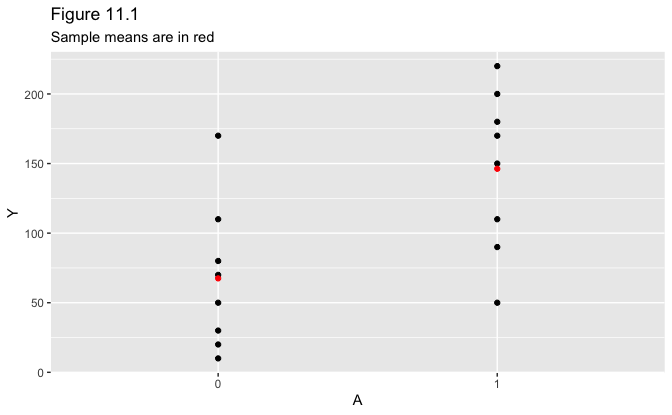
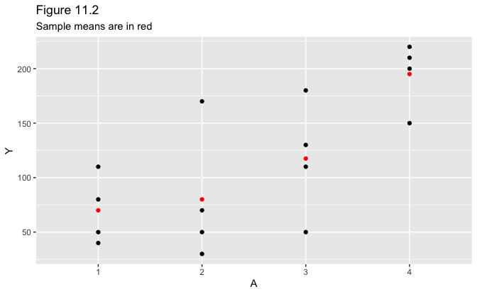
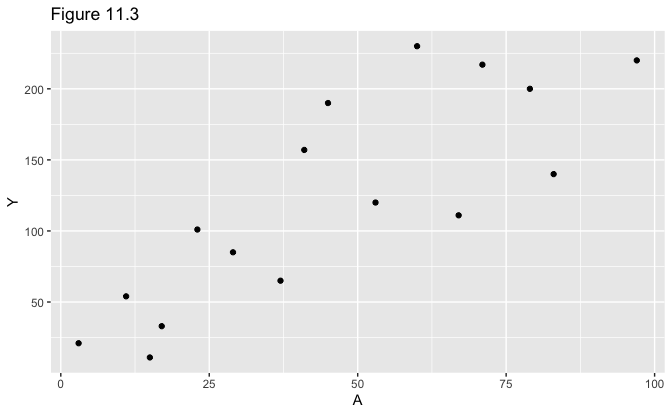
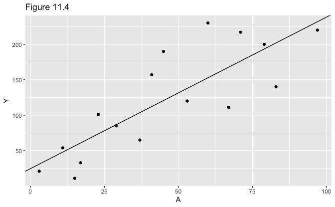
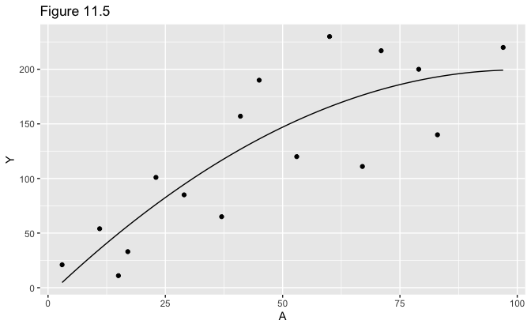

11 Why Model?
================
Bill Behrman
2022-06-01

-   [11.1 Data cannot speak for
    themselves](#111-data-cannot-speak-for-themselves)
-   [11.2 Parametric estimators of the conditional
    mean](#112-parametric-estimators-of-the-conditional-mean)
-   [11.3 Nonparametric estimators of the conditional
    mean](#113-nonparametric-estimators-of-the-conditional-mean)
-   [11.4 Smoothing](#114-smoothing)

``` r
# Packages
library(tidyverse)

# Parameters
  # Common code
file_common <- here::here("_common.R")

# Print tibble
kable <- function(x, nsmall = 2, ...) {
  knitr::kable(x, format.args = list(digits = nsmall, nsmall = nsmall), ...)
}

#===============================================================================

# Run common code
source(file_common)
```

## 11.1 Data cannot speak for themselves

Dataset 1.

``` r
data_1 <- 
  tibble(
    A = as.factor(c(1, 1, 1, 1, 1, 1, 1, 1, 0, 0, 0, 0, 0, 0, 0, 0)),
    Y = 
      c(200, 150, 220, 110, 50, 180, 90, 170, 170, 30, 70, 110, 80, 50, 10, 20)
  )
```

Figure 11.1.

``` r
data_1_means <- 
  data_1 %>% 
  group_by(A) %>% 
  summarize(across(Y, mean))

data_1 %>% 
  ggplot(aes(A, Y)) +
  geom_point() +
  geom_point(data = data_1_means, color = "red") +
  labs(
    title = "Figure 11.1",
    subtitle = "Sample means are in red"
  )
```



Sample means for levels of `A`.

``` r
kable(data_1_means)
```

| A   |      Y |
|:----|-------:|
| 0   |  67.50 |
| 1   | 146.25 |

Dataset 2.

``` r
data_2 <- 
  tibble(
    A = as.factor(c(1, 1, 1, 1, 2, 2, 2, 2, 3, 3, 3, 3, 4, 4, 4, 4)),
    Y = 
      c(110, 80, 50, 40, 170, 30, 70, 50, 110, 50, 180, 130, 200, 150, 220, 210)
  )
```

Figure 11.2.

``` r
data_2_means <- 
  data_2 %>% 
  group_by(A) %>% 
  summarize(across(Y, mean))

data_2 %>% 
  ggplot(aes(A, Y)) +
  geom_point() +
  geom_point(data = data_2_means, color = "red") +
  labs(
    title = "Figure 11.2",
    subtitle = "Sample means are in red"
  )
```



Sample means for levels of `A`.

``` r
kable(data_2_means, nsmall = 1)
```

| A   |     Y |
|:----|------:|
| 1   |  70.0 |
| 2   |  80.0 |
| 3   | 117.5 |
| 4   | 195.0 |

Dataset 3.

``` r
data_3 <- 
  tibble(
    A = c(3, 11, 17, 23, 29, 37, 41, 53, 67, 79, 83, 97, 60, 71, 15, 45),
    Y = 
      c(
        21, 54, 33, 101, 85, 65, 157, 120, 111, 200, 140, 220, 230, 217, 11, 190
      )
  )
```

Figure 11.3.

``` r
data_3 %>% 
  ggplot(aes(A, Y)) +
  geom_point() +
  labs(title = "Figure 11.3")
```



## 11.2 Parametric estimators of the conditional mean

Fit linear regression.

``` r
fit <- lm(Y ~ A, data = data_3)

broom::tidy(fit, conf.int = TRUE) %>% 
  select(term, estimate, conf_low = conf.low, conf_high = conf.high) %>% 
  kable()
```

| term        | estimate | conf_low | conf_high |
|:------------|---------:|---------:|----------:|
| (Intercept) |    24.55 |   -21.20 |     70.29 |
| A           |     2.14 |     1.28 |      2.99 |

Figure 11.4.

``` r
data_3 %>% 
  ggplot(aes(A, Y)) +
  geom_point() +
  geom_abline(slope = coef(fit)["A"], intercept = coef(fit)["(Intercept)"]) +
  labs(title = "Figure 11.4")
```



Predicted value of E\[`Y` \| `A` = 90\] with 95% confidence interval.

``` r
predict(fit, newdata = tibble(A = 90), interval = "confidence") %>% 
  as_tibble() %>% 
  rename(estimate = fit, conf_low = lwr, conf_high = upr) %>% 
  kable(nsmall = 1)
```

| estimate | conf_low | conf_high |
|---------:|---------:|----------:|
|    216.9 |    172.1 |     261.6 |

## 11.3 Nonparametric estimators of the conditional mean

Fit linear regression.

``` r
fit <- lm(Y ~ A, data = data_1)

broom::tidy(fit) %>% 
  select(term, estimate) %>% 
  kable()
```

| term        | estimate |
|:------------|---------:|
| (Intercept) |    67.50 |
| A1          |    78.75 |

Estimates of E\[`Y` \| `A`\] for `A` = 0 and `A` = 1.

``` r
tibble(
  A = as.factor(0:1),
  Y = predict(fit, newdata = tibble(A))
) %>% 
  kable()
```

| A   |      Y |
|:----|-------:|
| 0   |  67.50 |
| 1   | 146.25 |

## 11.4 Smoothing

Fit linear regression with quadratic term.

``` r
fit <- lm(Y ~ A + I(A^2), data = data_3)

broom::tidy(fit) %>% 
  select(term, estimate) %>% 
  kable()
```

| term        | estimate |
|:------------|---------:|
| (Intercept) |    -7.41 |
| A           |     4.11 |
| I(A^2)      |    -0.02 |

Figure 11.5.

``` r
line <- 
  tibble(
    A = seq(min(data_3$A), max(data_3$A), length.out = 201),
    Y = predict(fit, newdata = tibble(A))
  )

data_3 %>% 
  ggplot(aes(A, Y)) +
  geom_point() +
  geom_line(data = line) +
  labs(title = "Figure 11.5")
```



Predicted value of E\[`Y` \| `A` = 90\] with 95% confidence interval.

``` r
predict(fit, newdata = tibble(A = 90), interval = "confidence") %>% 
  as_tibble() %>% 
  rename(estimate = fit, conf_low = lwr, conf_high = upr) %>% 
  kable(nsmall = 1)
```

| estimate | conf_low | conf_high |
|---------:|---------:|----------:|
|    197.1 |    142.8 |     251.5 |
