12 IP weighting and marginal structural models
================
Bill Behrman
2022-06-05

-   [12.1 The causal question](#121-the-causal-question)
-   [12.2 Estimating IP weights via
    modeling](#122-estimating-ip-weights-via-modeling)
-   [12.3 Stabilized IP weights](#123-stabilized-ip-weights)
    -   [Fine Point 12.2 Checking
        positivity](#fine-point-122-checking-positivity)
-   [12.4 Marginal structural models](#124-marginal-structural-models)
-   [12.5 Effect modification and marginal structural
    models](#125-effect-modification-and-marginal-structural-models)
-   [12.6 Censoring and missing data](#126-censoring-and-missing-data)

``` r
# Packages
library(tidyverse)

# Parameters
  # NHEFS data
file_nhefs <- here::here("data/nhefs.rds")
  # Common code
file_common <- here::here("_common.R")

# Print tibble
kable <- function(x, nsmall = 2, ...) {
  knitr::kable(x, format.args = list(digits = nsmall, nsmall = nsmall), ...)
}
# Print min, mean, and max of vector
kable_summary <- function(x, nsmall = 2, ...) {
  tibble(min = min(x), mean = mean(x), max = max(x)) %>%
    knitr::kable(format.args = list(digits = nsmall, nsmall = nsmall), ...)
}

#===============================================================================

# Run common code
source(file_common)

# NHEFS data
nhefs <- read_rds(file_nhefs)

# NHEFS censored for those with weight measurements in 1982
nhefs_censored <- 
  nhefs %>% 
  drop_na(wt82, wt82_71)
```

## 12.1 The causal question

The data are from the [National Health and Nutrition Examination Survey
1 Epidemiologic Follow-up
Study](https://wwwn.cdc.gov/nchs/nhanes/nhefs/) (NHEFS). The data are
drawn from two questionnaires, one taken in 1971 and the other in 1982.
We will be using these variables:

-   `active`: In your usual day, how active are you? in 1971
    -   0: Very active
    -   1: Moderately active
    -   2: Inactive
-   `age`: Age in 1971
-   `death`: Death by 1992
    -   0: No
    -   1: Yes
-   `education`: Amount of education by 1971
    -   1: 8th grade or less
    -   2: High school dropout
    -   3: High school
    -   4: College dropout
    -   5: College or more
-   `exercise`: In recreation, how much exercise? in 1971
    -   0: Much exercise
    -   1: Moderate exercise
    -   2: Little or no exercise
-   `qsmk`: Quit smoking between 1971 and 1982 questionnaires
    -   0: No
    -   1: Yes
-   `race`: Race in 1971
    -   0: White
    -   1: Black or other
-   `sex`: Sex
    -   0: Male
    -   1: Female
-   `smokeintensity`: Number of cigarettes smoked per day in 1971
-   `smokeintensity82_71`: Increase in number of cigarettes smoked per
    day between 1971 and 1982
-   `smokeyrs`: Years of smoking
-   `wt71`: Weight in 1971 (kilograms)
-   `wt82`: Weight in 1982 (kilograms)
-   `wt82_71`: Weight change between 1971 and 1982 (kilograms)

The causal question is: What is the average causal effect of smoking
cessation (`qsmk`) on body weight gain (`wt82_71`)?

In the following we will examine the censored dataset of those with
weight measurements in 1982. Number of people in dataset.

``` r
nrow(nhefs_censored)
```

    #> [1] 1566

Range of ages.

``` r
range(nhefs_censored$age)
```

    #> [1] 25 74

Average weight gains in quitters and non-quitters.

``` r
v <- 
  nhefs_censored %>% 
  group_by(qsmk) %>% 
  summarize(across(wt82_71, mean))

kable(v, nsmall = 1)
```

| qsmk | wt82_71 |
|:-----|--------:|
| 0    |     2.0 |
| 1    |     4.5 |

The average weight gain was 4.5 kg in quitters and 2.0 kg in
non-quitters.

Create a simple linear model to get an estimate the difference in
average weight gains with a 95% confidence interval.

``` r
fit <- lm(wt82_71 ~ qsmk, data = nhefs_censored)

broom::tidy(fit, conf.int = TRUE) %>% 
  filter(term == "qsmk1") %>% 
  select(estimate, conf_low = conf.low, conf_high = conf.high) %>% 
  kable(nsmall = 1)
```

| estimate | conf_low | conf_high |
|---------:|---------:|----------:|
|      2.5 |      1.7 |       3.4 |

Table 12.1.

``` r
var_descriptions <- 
  c(
    age = "Age (years)",
    male = "Men (%)",
    white = "White (%)",
    university = "University (%)",
    wt71 = "Weight (kg)",
    smokeintensity = "Cigarettes per day",
    smokeyrs = "Years smoking",
    little_exercise = "Little exercise (%)",
    inactive = "Inactive life (%)"
  )

nhefs_censored %>% 
  transmute(
    qsmk,
    age,
    male = sex == "0",
    white = race == "0",
    university = education == "5",
    wt71,
    smokeintensity,
    smokeyrs,
    little_exercise = exercise == "2",
    inactive = active == "2"
  ) %>% 
  group_by(qsmk) %>% 
  summarize(across(everything(), mean)) %>% 
  mutate(
    across(c(male, white, university, little_exercise, inactive), ~ 100 * .)
  ) %>% 
  pivot_longer(cols = !qsmk, names_to = "Mean baseline characteristics") %>% 
  pivot_wider(names_from = qsmk, names_prefix = "A = ") %>% 
  mutate(across(`Mean baseline characteristics`, ~ var_descriptions[.])) %>% 
  relocate(`A = 0`, .after = `A = 1`) %>%
  kable(nsmall = 1)
```

| Mean baseline characteristics | A = 1 | A = 0 |
|:------------------------------|------:|------:|
| Age (years)                   |  46.2 |  42.8 |
| Men (%)                       |  54.6 |  46.6 |
| White (%)                     |  91.1 |  85.4 |
| University (%)                |  15.4 |   9.9 |
| Weight (kg)                   |  72.4 |  70.3 |
| Cigarettes per day            |  18.6 |  21.2 |
| Years smoking                 |  26.0 |  24.1 |
| Little exercise (%)           |  40.7 |  37.9 |
| Inactive life (%)             |  11.2 |   8.9 |

## 12.2 Estimating IP weights via modeling

Fit logistic regression model for propensity scores.

``` r
fit <- 
  glm(
    qsmk ~ sex + age + I(age^2) + race + education + wt71 + I(wt71^2) +
      smokeintensity + I(smokeintensity^2) + smokeyrs + I(smokeyrs^2) +
      active + exercise,
    family = binomial(),
    data = nhefs_censored
  )
```

Non-stabilized IP weights for treatment.

``` r
ip_w_a <- 
  case_when(
    nhefs_censored$qsmk == "0" ~ 1 / (1 - predict(fit, type = "response")),
    nhefs_censored$qsmk == "1" ~ 1 / predict(fit, type = "response"),
    TRUE ~ NA_real_
  )

kable_summary(ip_w_a)
```

|  min | mean |   max |
|-----:|-----:|------:|
| 1.05 | 2.00 | 16.70 |

Estimate average treatment effect (ATE) using weighted least squares.
This is a valid method for estimating the ATE but not its standard
error.

``` r
fit_lm <- lm(wt82_71 ~ qsmk, data = nhefs_censored, weights = ip_w_a)

broom::tidy(fit_lm)
```

    #> # A tibble: 2 × 5
    #>   term        estimate std.error statistic  p.value
    #>   <chr>          <dbl>     <dbl>     <dbl>    <dbl>
    #> 1 (Intercept)     1.78     0.288      6.18 8.40e-10
    #> 2 qsmk1           3.44     0.408      8.43 7.47e-17

Estimate ATE and its standard error using generalized estimating
equation model.

``` r
fit_geeglm <- 
  geepack::geeglm(
    wt82_71 ~ qsmk, data = nhefs_censored, weights = ip_w_a, id = seqn
  )

broom::tidy(fit_geeglm)
```

    #> # A tibble: 2 × 5
    #>   term        estimate std.error statistic  p.value
    #>   <chr>          <dbl>     <dbl>     <dbl>    <dbl>
    #> 1 (Intercept)     1.78     0.225      62.7 2.33e-15
    #> 2 qsmk1           3.44     0.525      42.9 5.86e-11

The two estimates for the ATE are very close.

``` r
ate_lm <- coef(fit_lm)[["qsmk1"]]
ate_geeglm <- coef(fit_geeglm)[["qsmk1"]]

ate_lm - ate_geeglm
```

    #> [1] 3.996803e-15

Estimate of ATE with 95% confidence interval.

``` r
v <- 
  broom::tidy(fit_geeglm, conf.int = TRUE) %>% 
  filter(term == "qsmk1") %>% 
  select(estimate, conf_low = conf.low, conf_high = conf.high)

kable(v, nsmall = 1)
```

| estimate | conf_low | conf_high |
|---------:|---------:|----------:|
|      3.4 |      2.4 |       4.5 |

Plot treatment levels for each confounder.

``` r
plot_treatment <- function(var, weights, bins = 25) {
  v <- 
    nhefs_censored %>% 
    add_column(weights = weights) %>% 
    group_by({{var}}, qsmk) %>%
    summarize(n = sum(weights)) %>% 
    ungroup()
  
  if (is.factor(pull(nhefs_censored, {{var}}))) {
    v %>% 
      ggplot(aes({{var}}, n)) +
      geom_col(aes(fill = qsmk), position = "dodge")
  } else if (is.numeric(pull(nhefs_censored, {{var}}))) {
    v %>% 
      ggplot(aes({{var}})) +
      geom_freqpoly(aes(color = qsmk, weight = n), bins = bins)
  } else {
    NULL
  }
}

confounders <- 
  vars(
    sex, age, race, education, smokeintensity, smokeyrs, active, exercise, wt71
  )

confounders %>%
  map(plot_treatment, weights = ip_w_a) %>% 
  walk(print)
```

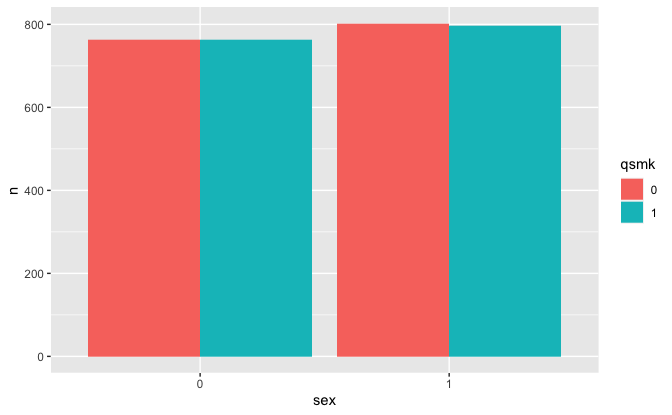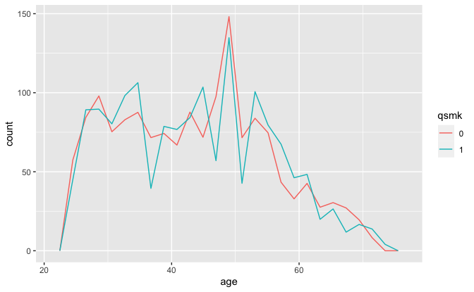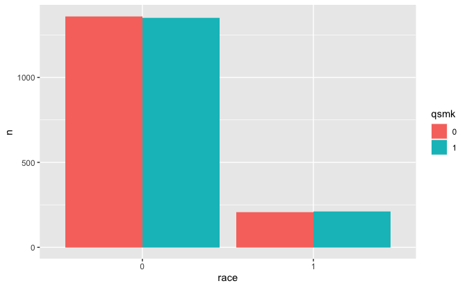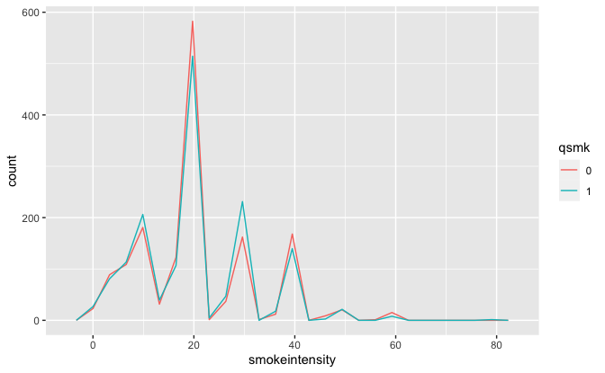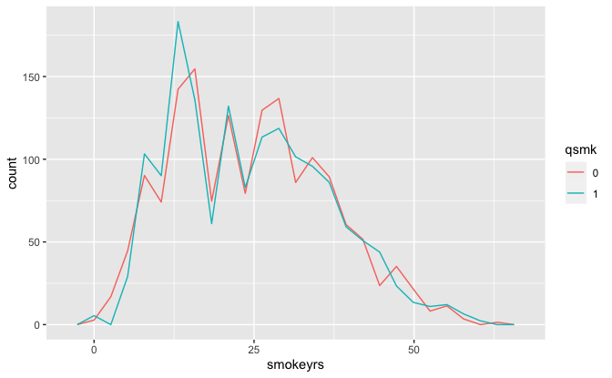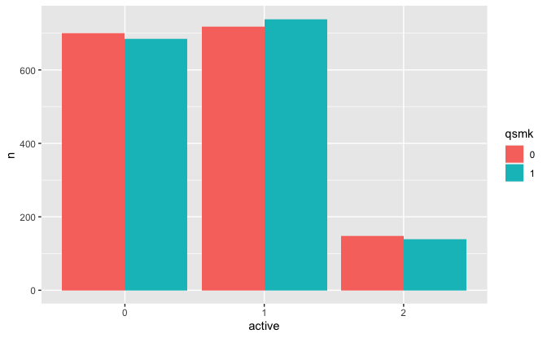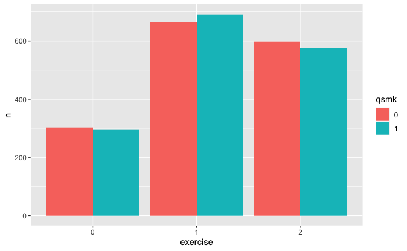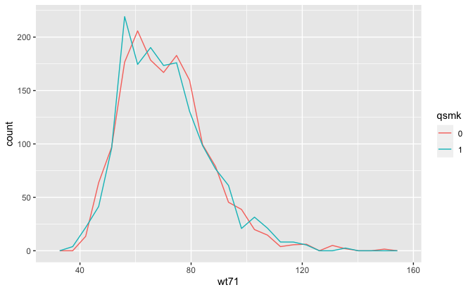

In the pseudo-population with nonstabilized IP weighting, the treatment
populations are roughly equal.

## 12.3 Stabilized IP weights

Stabilized IP weights for treatment.

``` r
ip_sw_a <- 
  case_when(
    nhefs_censored$qsmk == "0" ~ 1 - mean(nhefs_censored$qsmk == "1"),
    nhefs_censored$qsmk == "1" ~ mean(nhefs_censored$qsmk == "1"),
    TRUE ~ NA_real_
  ) * 
  ip_w_a

kable_summary(ip_sw_a)
```

|  min | mean |  max |
|-----:|-----:|-----:|
| 0.33 | 1.00 | 4.30 |

Estimate ATE and its standard error using generalized estimating
equation model.

``` r
fit_geeglm <- 
  geepack::geeglm(
    wt82_71 ~ qsmk, data = nhefs_censored, weights = ip_sw_a, id = seqn
  )

broom::tidy(fit_geeglm)
```

    #> # A tibble: 2 × 5
    #>   term        estimate std.error statistic  p.value
    #>   <chr>          <dbl>     <dbl>     <dbl>    <dbl>
    #> 1 (Intercept)     1.78     0.225      62.7 2.33e-15
    #> 2 qsmk1           3.44     0.525      42.9 5.86e-11

Estimate of ATE with 95% confidence interval.

``` r
v <- 
  broom::tidy(fit_geeglm, conf.int = TRUE) %>% 
  filter(term == "qsmk1") %>% 
  select(estimate, conf_low = conf.low, conf_high = conf.high)

kable(v, nsmall = 1)
```

| estimate | conf_low | conf_high |
|---------:|---------:|----------:|
|      3.4 |      2.4 |       4.5 |

Plot treatment levels for each confounder.

``` r
confounders %>%
  map(plot_treatment, weights = ip_sw_a) %>% 
  walk(print)
```

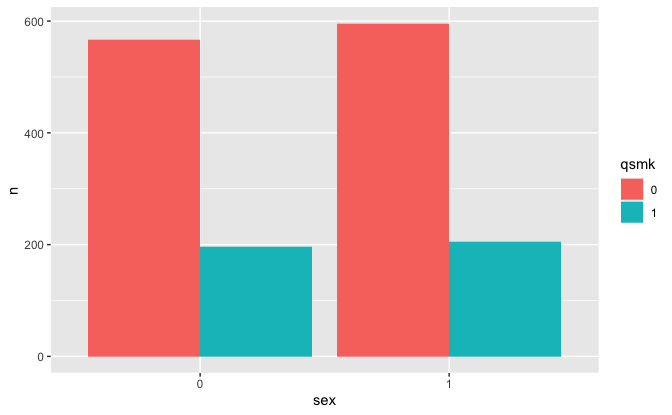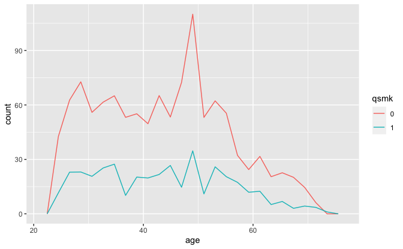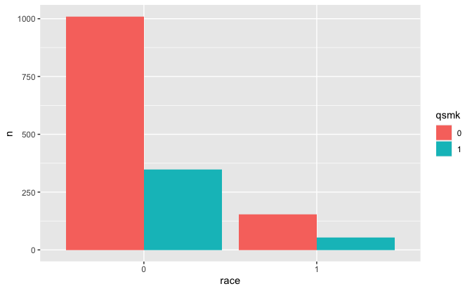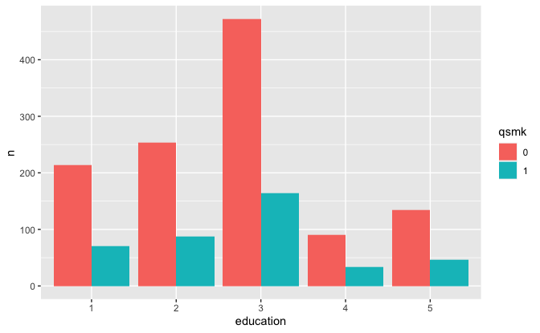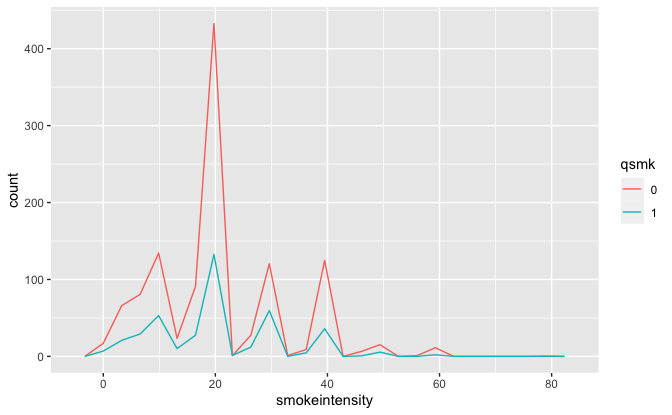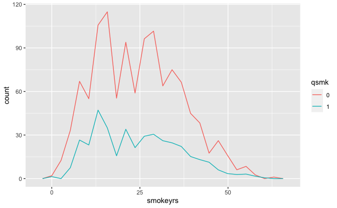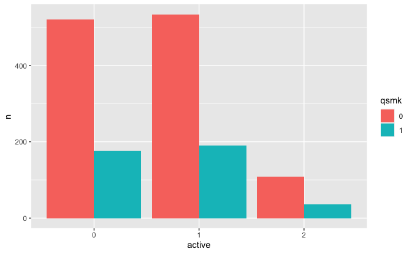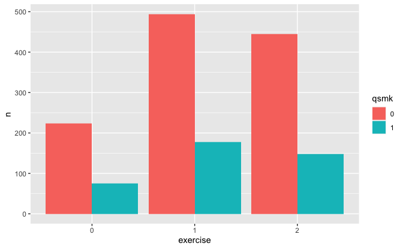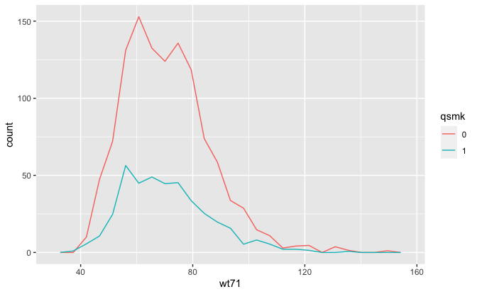

In the pseudo-population with stabilized IP weighting, the treatment
populations are now unequal. These populations reflect the fact that
approximately 74.3% of the participants did not quit smoking (`qsmk` =
0) and 25.7% of the participants did (`qsmk` = 1).

### Fine Point 12.2 Checking positivity

Count number of individuals in all combinations of `sex`, `age`, and
`qsmk`.

``` r
v <- 
  nhefs_censored %>% 
  expand(sex, age = full_seq(age, 1), qsmk) %>% 
  left_join(
    nhefs_censored %>% 
      mutate(n = 1),
    by = c("sex", "age", "qsmk")
  ) %>% 
  count(sex, age, qsmk, wt = n)

v
```

    #> # A tibble: 200 × 4
    #>    sex     age qsmk      n
    #>    <fct> <dbl> <fct> <dbl>
    #>  1 0        25 0        20
    #>  2 0        25 1         6
    #>  3 0        26 0        21
    #>  4 0        26 1         5
    #>  5 0        27 0        11
    #>  6 0        27 1         5
    #>  7 0        28 0        22
    #>  8 0        28 1         3
    #>  9 0        29 0        18
    #> 10 0        29 1         2
    #> # … with 190 more rows

Number of combinations by number of individuals in combination.

``` r
v %>% 
  ggplot(aes(n)) +
  geom_bar() +
  labs(
    title = "Number of combinations by number of individuals in combination",
    x = "Number of individuals in combination",
    y = "Number of combinations"
  )
```

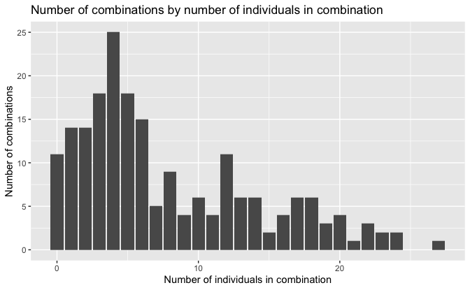

Eleven combinations have no individuals.

``` r
v %>%
  filter(n == 0) %>% 
  kable(nsmall = 0)
```

| sex | age | qsmk |   n |
|:----|----:|:-----|----:|
| 0   |  71 | 1    |   0 |
| 0   |  73 | 0    |   0 |
| 0   |  73 | 1    |   0 |
| 0   |  74 | 0    |   0 |
| 1   |  66 | 1    |   0 |
| 1   |  67 | 1    |   0 |
| 1   |  68 | 1    |   0 |
| 1   |  71 | 0    |   0 |
| 1   |  73 | 0    |   0 |
| 1   |  73 | 1    |   0 |
| 1   |  74 | 0    |   0 |

## 12.4 Marginal structural models

In this section, we will estimate causal effect of the change in smoking
intensity (`smkintensity82_71`), a continuous variable, on the average
weight gain (`wt82_71`).

Distribution of `smokeintensity`.

``` r
nhefs_censored %>% 
  ggplot(aes(smokeintensity)) +
  geom_histogram(binwidth = 5, boundary = 0) +
  labs(title = "Distribution of smokeintensity")
```

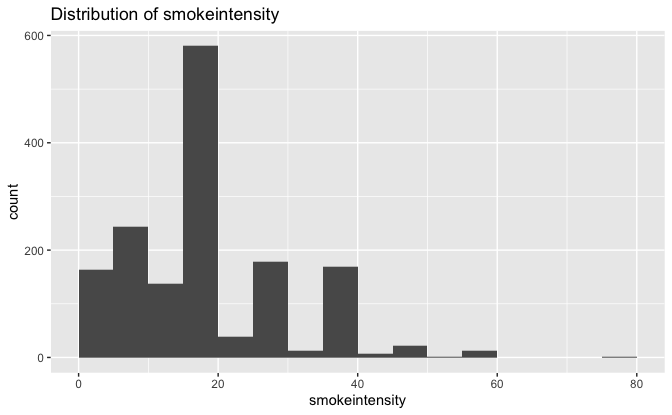

Create subset of data with individuals who smoked 25 or fewer cigarettes
per day at baseline.

``` r
nhefs_censored_smoke_25 <- 
  nhefs_censored %>% 
  filter(smokeintensity <= 25)
```

Number of individuals in subset.

``` r
nrow(nhefs_censored_smoke_25)
```

    #> [1] 1162

Numerator for IP weights.

``` r
treatment <- nhefs_censored_smoke_25$smkintensity82_71

ip_numerator <- 
  dnorm(
    treatment,
    mean = mean(treatment),
    sd = sd(treatment)
  )
```

The numerator for the IP weights approximates `smkintensity82_71` with a
normal distribution. Here is the actual distribution of
`smkintensity82_71` with its normal approximation.

``` r
normal_approx <-
  tibble(
    x = seq(min(treatment), max(treatment), length.out = 201),
    y = dnorm(x, mean = mean(treatment), sd = sd(treatment))
  )

nhefs_censored_smoke_25 %>% 
  ggplot() +
  geom_histogram(
    aes(smkintensity82_71, stat(density)),
    binwidth = 5,
    boundary = 0
  ) +
  geom_line(aes(x, y), data = normal_approx, color = "red") +
  labs(
    title = "Distribution of smokeintensity82_71",
    subtitle = "With normal approximation in red"
  )
```

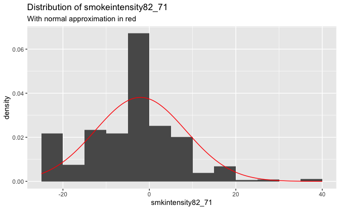

Denominator for IP weights.

``` r
fit <- 
  lm(
    smkintensity82_71 ~ sex + age + I(age^2) + race + education +
      wt71 + I(wt71^2) + smokeintensity + I(smokeintensity^2) +
      smokeyrs + I(smokeyrs^2) + active + exercise,
    data = nhefs_censored_smoke_25
  )

ip_denominator <- 
  dnorm(
    treatment,
    mean = predict(fit, type = "response"),
    sd = sigma(fit)
  )
```

IP weights for marginal structural model.

``` r
ip_msm <- ip_numerator / ip_denominator

kable_summary(ip_msm)
```

|  min | mean |  max |
|-----:|-----:|-----:|
| 0.19 | 1.00 | 5.10 |

Fit marginal structural model.

``` r
fit <- 
  geepack::geeglm(
    wt82_71 ~ smkintensity82_71 + I(smkintensity82_71^2),
    data = nhefs_censored_smoke_25,
    weights = ip_msm,
    id = seqn
  )

broom::tidy(fit)
```

    #> # A tibble: 3 × 5
    #>   term                   estimate std.error statistic  p.value
    #>   <chr>                     <dbl>     <dbl>     <dbl>    <dbl>
    #> 1 (Intercept)             2.00      0.295       46.1  1.10e-11
    #> 2 smkintensity82_71      -0.109     0.0315      11.9  5.48e- 4
    #> 3 I(smkintensity82_71^2)  0.00269   0.00242      1.24 2.65e- 1

Coefficients of model.

``` r
broom::tidy(fit) %>% 
  select(term, estimate) %>% 
  kable(nsmall = 1)
```

| term                   | estimate |
|:-----------------------|---------:|
| (Intercept)            |    2.005 |
| smkintensity82_71      |   -0.109 |
| I(smkintensity82_71^2) |    0.003 |

Mean weight gain with 95% confidence interval for constant smoking
intensity.

``` r
broom::tidy(fit, conf.int = TRUE) %>% 
  filter(term == "(Intercept)") %>% 
  select(estimate, conf_low = conf.low, conf_high = conf.high) %>% 
  kable(nsmall = 1)
```

| estimate | conf_low | conf_high |
|---------:|---------:|----------:|
|      2.0 |      1.4 |       2.6 |

Mean weight gain with 95% confidence interval for increase in smoking
intensity of 20 cigarettes per day.

``` r
fit <- 
  geepack::geeglm(
    wt82_71 ~ I(smkintensity82_71 - 20) + I((smkintensity82_71 - 20)^2),
    data = nhefs_censored_smoke_25,
    weights = ip_msm,
    id = seqn
  )

broom::tidy(fit, conf.int = TRUE) %>% 
  filter(term == "(Intercept)") %>% 
  select(estimate, conf_low = conf.low, conf_high = conf.high) %>% 
  kable(nsmall = 1)
```

| estimate | conf_low | conf_high |
|---------:|---------:|----------:|
|      0.9 |     -1.7 |       3.5 |

Marginal structural model for causal effect of quitting smoking (`qsmk`)
on the risk of death by 1992 (`death`). For this calculation, we will
convert the type of `qsmk` and `death` from factor to double.

``` r
fit <- 
  nhefs_censored %>% 
  mutate(across(c(qsmk, death), ~ as.double(.) - 1)) %>%
  geepack::geeglm(
    death ~ qsmk, family = binomial(), data = ., weights = ip_sw_a, id = seqn
  )

broom::tidy(fit)
```

    #> # A tibble: 2 × 5
    #>   term        estimate std.error statistic p.value
    #>   <chr>          <dbl>     <dbl>     <dbl>   <dbl>
    #> 1 (Intercept)  -1.49      0.0789  356.       0    
    #> 2 qsmk          0.0301    0.157     0.0367   0.848

Estimate of causal odds ratio with 95% confidence interval.

``` r
broom::tidy(fit, conf.int = TRUE, exponentiate = TRUE) %>% 
  filter(term == "qsmk") %>% 
  select(estimate, conf_low = conf.low, conf_high = conf.high) %>% 
  kable(nsmall = 1)
```

| estimate | conf_low | conf_high |
|---------:|---------:|----------:|
|      1.0 |      0.8 |       1.4 |

## 12.5 Effect modification and marginal structural models

IP weights.

``` r
fit <- glm(qsmk ~ sex, family = binomial(), data = nhefs_censored)

ip_sw_a <- 
  case_when(
    nhefs_censored$qsmk == "0" ~ (1 - predict(fit, type = "response")),
    nhefs_censored$qsmk == "1" ~ predict(fit, type = "response"),
    TRUE ~ NA_real_
  ) *
  ip_w_a

kable_summary(ip_sw_a)
```

|  min | mean |  max |
|-----:|-----:|-----:|
| 0.29 | 1.00 | 3.80 |

Fit marginal structural model.

``` r
fit <- 
  geepack::geeglm(
    wt82_71 ~ qsmk * sex, data = nhefs_censored, weights = ip_sw_a, id = seqn
  )

broom::tidy(fit)
```

    #> # A tibble: 4 × 5
    #>   term        estimate std.error statistic       p.value
    #>   <chr>          <dbl>     <dbl>     <dbl>         <dbl>
    #> 1 (Intercept)  1.78        0.310 33.2      0.00000000845
    #> 2 qsmk1        3.52        0.657 28.7      0.0000000832 
    #> 3 sex1        -0.00872     0.449  0.000378 0.984        
    #> 4 qsmk1:sex1  -0.159       1.05   0.0232   0.879

Estimate of effect modification by sex.

``` r
broom::tidy(fit, conf.int = TRUE) %>% 
  filter(term == "qsmk1:sex1") %>% 
  select(estimate, conf_low = conf.low, conf_high = conf.high) %>% 
  kable(nsmall = 1)
```

| estimate | conf_low | conf_high |
|---------:|---------:|----------:|
|     -0.2 |     -2.2 |       1.9 |

## 12.6 Censoring and missing data

Number of individuals in full dataset.

``` r
nrow(nhefs)
```

    #> [1] 1629

Number of individual whose body weight in 1982 is missing.

``` r
sum(is.na(nhefs$wt82))
```

    #> [1] 63

Add `censored` variable to `nhefs` to indicate whether or not body
weight in 1982 (`wt82`) is missing.

``` r
nhefs <- 
  nhefs %>% 
  mutate(censored = if_else(!is.na(wt82), "0", "1") %>% as.factor())
```

The treatment `qsmk` is associated with censoring.

``` r
v <- 
  nhefs %>% 
  group_by(qsmk) %>% 
  summarize(censored = mean(censored == "1"))

kable(v)
```

| qsmk | censored |
|:-----|---------:|
| 0    |    0.032 |
| 1    |    0.058 |

5.8% of quitters versus 3.2% of non-quitters were censored.

The predictor `wt71` is also associated with censoring.

``` r
v <- 
  nhefs %>% 
  group_by(censored) %>% 
  summarize(across(wt71, mean))

kable(v, nsmall = 1)
```

| censored | wt71 |
|:---------|-----:|
| 0        | 70.8 |
| 1        | 76.6 |

The average baseline weight was 76.6 kg in the censored versus 70.8 kg
in the uncensored.

Stabilized IP weights for treatment.

``` r
ip_numerator <- 
  case_when(
    nhefs$qsmk == "0" ~ 1 - mean(nhefs$qsmk == "1"),
    nhefs$qsmk == "1" ~ mean(nhefs$qsmk == "1"),
    TRUE ~ NA_real_
  )

fit_denominator <- 
  glm(
    qsmk ~ sex + age + I(age^2) + race + education + wt71 + I(wt71^2) +
      smokeintensity + I(smokeintensity^2) + smokeyrs + I(smokeyrs^2) +
      active + exercise,
    family = binomial(),
    data = nhefs
  )

ip_denominator <- 
  case_when(
    nhefs$qsmk == "0" ~ 1 - predict(fit_denominator, type = "response"),
    nhefs$qsmk == "1" ~ predict(fit_denominator, type = "response"),
    TRUE ~ NA_real_
  )

ip_sw_a <- ip_numerator / ip_denominator 
```

Stabilized IP weights for censoring.

``` r
fit_numerator <- glm(censored ~ qsmk, family = binomial(), data = nhefs)

ip_numerator <- 
  case_when(
    nhefs$censored == "0" ~ 1 - predict(fit_numerator, type = "response"),
    nhefs$censored == "1" ~ predict(fit_numerator, type = "response"),
    TRUE ~ NA_real_
  )

fit_denominator <- 
  glm(
    censored ~ qsmk + sex + age + I(age^2) + race + education +
      wt71 + I(wt71^2) + smokeintensity + I(smokeintensity^2) +
      smokeyrs + I(smokeyrs^2) + active + exercise,
    family = binomial(),
    data = nhefs
  )

ip_denominator <- 
  case_when(
    nhefs$censored == "0" ~ 1 - predict(fit_denominator, type = "response"),
    nhefs$censored == "1" ~ predict(fit_denominator, type = "response"),
    TRUE ~ NA_real_
  )

ip_sw_c <- ip_numerator / ip_denominator
```

Stabilized IP weights for treatment and censoring

``` r
ip_sw_ac = ip_sw_a * ip_sw_c

kable_summary(ip_sw_ac[nhefs$censored == "0"])
```

|  min | mean |  max |
|-----:|-----:|-----:|
| 0.35 | 1.00 | 4.09 |

Estimate ATE and its standard error using generalized estimating
equation model.

``` r
fit_geeglm <- 
  geepack::geeglm(
    wt82_71 ~ qsmk,
    data = nhefs_censored,
    weights = ip_sw_ac[nhefs$censored == "0"],
    id = seqn
  )

broom::tidy(fit_geeglm)
```

    #> # A tibble: 2 × 5
    #>   term        estimate std.error statistic  p.value
    #>   <chr>          <dbl>     <dbl>     <dbl>    <dbl>
    #> 1 (Intercept)     1.66     0.233      51.0 9.29e-13
    #> 2 qsmk1           3.50     0.526      44.2 2.89e-11

Estimate of ATE with 95% confidence interval.

``` r
v <- 
  broom::tidy(fit_geeglm, conf.int = TRUE) %>% 
  filter(term == "qsmk1") %>% 
  select(estimate, conf_low = conf.low, conf_high = conf.high)

kable(v, nsmall = 1)
```

| estimate | conf_low | conf_high |
|---------:|---------:|----------:|
|      3.5 |      2.5 |       4.5 |
