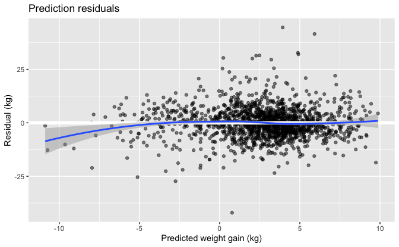
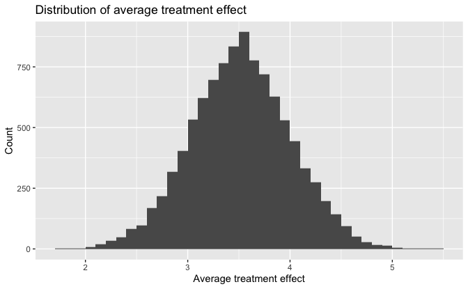

13 Standardization and the parametric g-formula
================
Bill Behrman
2022-06-04

-   [13.1 Standardization as an alternative to IP
    weighting](#131-standardization-as-an-alternative-to-ip-weighting)
-   [13.2 Estimating the mean outcome via
    modeling](#132-estimating-the-mean-outcome-via-modeling)
-   [13.3 Standardizing the mean outcome to the confounder
    distribution](#133-standardizing-the-mean-outcome-to-the-confounder-distribution)

``` r
# Packages
library(tidyverse)

# Parameters
  # NHEFS data
file_nhefs <- here::here("data/nhefs.rds")
  # Common code
file_common <- here::here("_common.R")

# Print tibble
kable <- function(x, nsmall = 2, ...) {
  knitr::kable(x, format.args = list(digits = nsmall, nsmall = nsmall), ...)
}
# Print min, mean, and max of vector
kable_summary <- function(x, nsmall = 2, ...) {
  tibble(min = min(x), mean = mean(x), max = max(x)) %>%
    knitr::kable(format.args = list(digits = nsmall, nsmall = nsmall), ...)
}

#===============================================================================

# Run common code
source(file_common)

# NHEFS data
nhefs <- read_rds(file_nhefs)

# NHEFS censored for those with weight measurements in 1982
nhefs_censored <- 
  nhefs %>% 
  drop_na(wt82, wt82_71)
```

## 13.1 Standardization as an alternative to IP weighting

Number of individuals in full dataset

``` r
nrow(nhefs)
```

    #> [1] 1629

Number of individuals with weight measurements in 1982.

``` r
nrow(nhefs_censored)
```

    #> [1] 1566

## 13.2 Estimating the mean outcome via modeling

In this section, we will use the censored dataset of those with weight
measurements in 1982

Count untreated and treated individuals.

``` r
v <- 
  nhefs_censored %>% 
  count(qsmk)

knitr::kable(v)
```

| qsmk |    n |
|:-----|-----:|
| 0    | 1163 |
| 1    |  403 |

There are 1163 untreated individuals and 403 treated individuals.

Fit linear regression model for weight gain.

``` r
fit <- 
  lm(
    wt82_71 ~ qsmk * smokeintensity + sex + age + I(age^2) + race + education +
      wt71 + I(wt71^2) + I(smokeintensity^2) + smokeyrs + I(smokeyrs^2) +
      active + exercise,
    data = nhefs_censored
  )

broom::tidy(fit)
```

    #> # A tibble: 21 × 5
    #>    term           estimate std.error statistic  p.value
    #>    <chr>             <dbl>     <dbl>     <dbl>    <dbl>
    #>  1 (Intercept)    -1.59      4.31       -0.368 0.713   
    #>  2 qsmk1           2.56      0.809       3.16  0.00159 
    #>  3 smokeintensity  0.0491    0.0517      0.950 0.342   
    #>  4 sex1           -1.43      0.469      -3.05  0.00233 
    #>  5 age             0.360     0.163       2.20  0.0278  
    #>  6 I(age^2)       -0.00610   0.00173    -3.53  0.000421
    #>  7 race1           0.560     0.582       0.963 0.336   
    #>  8 education2      0.790     0.607       1.30  0.193   
    #>  9 education3      0.556     0.556       1.00  0.317   
    #> 10 education4      1.49      0.832       1.79  0.0733  
    #> # … with 11 more rows

Predict weight gain for individuals.

``` r
nhefs_censored_pred <- 
  nhefs_censored %>% 
  mutate(.pred = predict(fit))
```

The individual with the unique identifier 24770.

``` r
v <- 
  nhefs_censored_pred %>% 
  filter(seqn == 24770)
```

This person’s characteristics.

``` r
v %>% 
  select(
    seqn, qsmk, sex, race, age, education, smokeintensity, smokeyrs, exercise,
    active, wt71
  ) %>% 
  knitr::kable()
```

|  seqn | qsmk | sex | race | age | education | smokeintensity | smokeyrs | exercise | active |   wt71 |
|------:|:-----|:----|:-----|----:|:----------|---------------:|---------:|:---------|:-------|-------:|
| 24770 | 0    | 0   | 0    |  26 | 4         |             15 |       12 | 1        | 0      | 111.58 |

This person was a white male who did not quit smoking. In 1971, he was
age 26, a college dropout, smoked 15 cigarettes a day, had been smoking
for 12 years, had moderate exercise, was very active, and weighed 111.58
kg.

This person’s observed and predicted weight gain.

``` r
v %>% 
  select(wt82_71, .pred) %>% 
  kable()
```

| wt82_71 | .pred |
|--------:|------:|
|    3.18 |  0.34 |

The person was observed to gain 3.18 kg between 1971 and 1982 and was
predicted to gain 0.34 kg.

Observed weight gain for individuals.

``` r
kable_summary(nhefs_censored$wt82_71, nsmall = 1)
```

|   min | mean |  max |
|------:|-----:|-----:|
| -41.3 |  2.6 | 48.5 |

Predicted weight gain for individuals.

``` r
kable_summary(nhefs_censored_pred$.pred, nsmall = 1)
```

|   min | mean | max |
|------:|-----:|----:|
| -10.9 |  2.6 | 9.9 |

The mean observed weight gain and the mean predicted weight gain are
very close.

``` r
mean(nhefs_censored$wt82_71) - mean(nhefs_censored_pred$.pred)
```

    #> [1] -4.884981e-14

Prediction residuals.

``` r
nhefs_censored_pred %>% 
  ggplot(aes(.pred, wt82_71 - .pred)) +
  geom_point(alpha = 0.5) +
  geom_hline(yintercept = 0, color = "white", size = 2) +
  geom_smooth(method = "loess", formula = y ~ x) +
  labs(
    title = "Prediction residuals",
    x = "Predicted weight gain (kg)",
    y = "Residual (kg)"
  )
```



## 13.3 Standardizing the mean outcome to the confounder distribution

Data from Table 2.2.

``` r
df <- 
  tribble(
    ~name,       ~L, ~A, ~Y,
    "Rheia",      0,  0,  0,
    "Kronos",     0,  0,  1,
    "Demeter",    0,  0,  0,
    "Hades",      0,  0,  0,
    "Hestia",     0,  1,  0,
    "Poseidon",   0,  1,  0,
    "Hera",       0,  1,  0,
    "Zeus",       0,  1,  1,
    "Artemis",    1,  0,  1,
    "Apollo",     1,  0,  1,
    "Leto",       1,  0,  0,
    "Ares",       1,  1,  1,
    "Athena",     1,  1,  1,
    "Hephaestus", 1,  1,  1,
    "Aphrodite",  1,  1,  1,
    "Cyclope",    1,  1,  1,
    "Persephone", 1,  1,  1,
    "Hermes",     1,  1,  0,
    "Hebe",       1,  1,  0,
    "Dionysus",   1,  1,  0
  ) %>% 
  mutate(across(c(L, A, Y), as.factor))
```

Fit logistic regression model for outcome `Y`.

``` r
fit <- glm(Y ~ A * L, family = binomial(), data = df)

broom::tidy(fit)
```

    #> # A tibble: 4 × 5
    #>   term         estimate std.error statistic p.value
    #>   <chr>           <dbl>     <dbl>     <dbl>   <dbl>
    #> 1 (Intercept) -1.10e+ 0      1.15 -9.51e- 1   0.341
    #> 2 A1          -4.59e-16      1.63 -2.81e-16   1    
    #> 3 L1           1.79e+ 0      1.68  1.06e+ 0   0.287
    #> 4 A1:L1        0             2.16  0          1

Estimate mean value of `Y` for each individual when untreated (`A` = 0)
and treated (`A` = 1).

``` r
pred_means <- 
  tibble(
    Y_A_0 = 
      mean(predict(fit, newdata = df %>% mutate(A = "0"), type = "response")),
    Y_A_1 = 
      mean(predict(fit, newdata = df %>% mutate(A = "1"), type = "response"))
  )

kable(pred_means)
```

| Y_A\_0 | Y_A\_1 |
|-------:|-------:|
|   0.50 |   0.50 |

The standardized mean outcomes were 0.50 for both the untreated and
treated.

We’ll now use the same procedure with the NHEFS data.

Fit linear regression model for weight gain.

``` r
fit <- 
  lm(
    wt82_71 ~ qsmk * smokeintensity + sex + age + I(age^2) + race + education +
      wt71 + I(wt71^2) + I(smokeintensity^2) + smokeyrs + I(smokeyrs^2) +
      active + exercise,
    data = nhefs_censored
  )

broom::tidy(fit)
```

    #> # A tibble: 21 × 5
    #>    term           estimate std.error statistic  p.value
    #>    <chr>             <dbl>     <dbl>     <dbl>    <dbl>
    #>  1 (Intercept)    -1.59      4.31       -0.368 0.713   
    #>  2 qsmk1           2.56      0.809       3.16  0.00159 
    #>  3 smokeintensity  0.0491    0.0517      0.950 0.342   
    #>  4 sex1           -1.43      0.469      -3.05  0.00233 
    #>  5 age             0.360     0.163       2.20  0.0278  
    #>  6 I(age^2)       -0.00610   0.00173    -3.53  0.000421
    #>  7 race1           0.560     0.582       0.963 0.336   
    #>  8 education2      0.790     0.607       1.30  0.193   
    #>  9 education3      0.556     0.556       1.00  0.317   
    #> 10 education4      1.49      0.832       1.79  0.0733  
    #> # … with 11 more rows

Estimate mean value of weight gain for each individual (`wt82_71`) when
untreated (`qsmk` = 0) and treated (`qsmk` = 1).

``` r
pred_means <- 
  tibble(
    wt82_71_qsmk_0 = mean(predict(fit, newdata = nhefs %>% mutate(qsmk = "0"))),
    wt82_71_qsmk_1 = mean(predict(fit, newdata = nhefs %>% mutate(qsmk = "1")))
  )

kable(pred_means)
```

| wt82_71_qsmk_0 | wt82_71_qsmk_1 |
|---------------:|---------------:|
|           1.66 |           5.18 |

The standardized mean in the untreated is 1.66 kg, and the standardized
mean in the treated is 5.18 kg. So the estimate for the ATE is 3.5 kg.

We will now use bootstrapping to obtain a confidence interval for this
estimate.

ATE using fit on sample of data.

``` r
ate <- function(data, sample_rows) {
  fit <- 
    lm(
      wt82_71 ~ qsmk * smokeintensity + sex + age + I(age^2) + race +
        education + wt71 + I(wt71^2) + I(smokeintensity^2) +
        smokeyrs + I(smokeyrs^2) + active + exercise,
      data = data %>% slice(sample_rows)
    )
  
  mean(predict(fit, newdata = nhefs %>% mutate(qsmk = "1"))) -
    mean(predict(fit, newdata = nhefs %>% mutate(qsmk = "0")))
}
```

Perform bootstrap resampling.

``` r
set.seed(231)

n_boot <- 1e4

boot_out <- boot::boot(data = nhefs_censored, statistic = ate, R = n_boot)
```

Distribution of average treatment effect.

``` r
tibble(ate = boot_out$t) %>% 
  ggplot(aes(ate)) +
  geom_histogram(binwidth = 0.1, boundary = 0) +
  labs(
    title = "Distribution of average treatment effect",
    x = "Average treatment effect",
    y = "Count"
  )
```



Estimate of ATE with 95% confidence interval calculated using
bias-corrected and accelerated (BCa) method.

``` r
estimate <- ate(data = nhefs_censored, sample_rows = 1:nrow(nhefs_censored))

v <- 
  broom::tidy(boot_out, conf.int = TRUE, conf.method = "bca") %>% 
  transmute(estimate, conf_low = conf.low, conf_high = conf.high)

kable(v, nsmall = 1)
```

| estimate | conf_low | conf_high |
|---------:|---------:|----------:|
|      3.5 |      2.6 |       4.5 |
