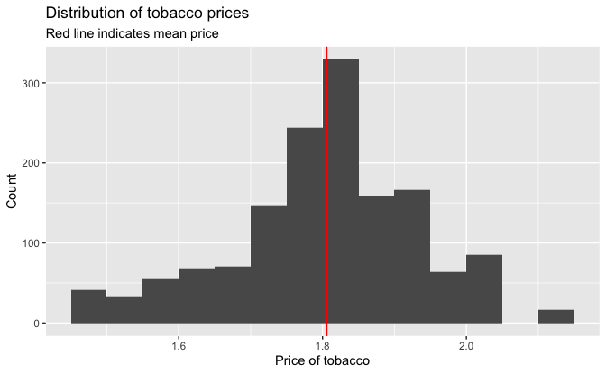
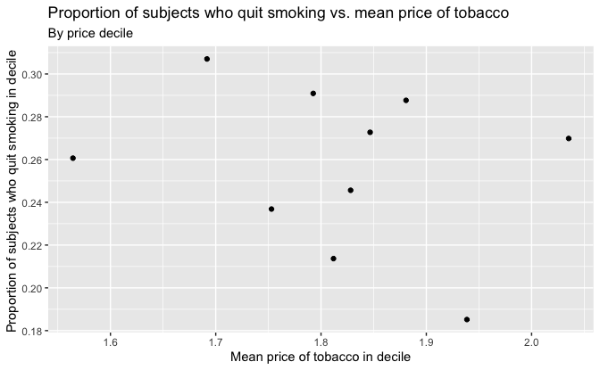

16 Instrumental variable estimation
================
Bill Behrman
2022-06-09

-   [16.1 The three instrumental
    conditions](#161-the-three-instrumental-conditions)
-   [16.2 The usual IV estimand](#162-the-usual-iv-estimand)
-   [16.5 The three instrumental conditions
    revisited](#165-the-three-instrumental-conditions-revisited)

``` r
# Packages
library(tidyverse)

# Parameters
  # NHEFS data
file_nhefs <- here::here("data/nhefs.rds")
  # Common code
file_common <- here::here("_common.R")

# Print tibble
kable <- function(x, nsmall = 2, ...) {
  knitr::kable(x, format.args = list(digits = nsmall, nsmall = nsmall), ...)
}

#===============================================================================

# Run common code
source(file_common)

# NHEFS data with `qsmk` as a double
nhefs <- 
  read_rds(file_nhefs) %>% 
  mutate(qsmk = as.double(qsmk) - 1)

# NHEFS censored to remove missing weight and price measurements in 1982
nhefs_censored <- 
  nhefs %>% 
  drop_na(wt82, wt82_71, price82)
```

## 16.1 The three instrumental conditions

In the following with will consider `price82` as an instrumental
variable:

-   `price82`: Average tobacco price in state of residence in 1982
    ($USD 2008)

Range of tobacco prices.

``` r
summary(nhefs_censored$price82)
```

    #>    Min. 1st Qu.  Median    Mean 3rd Qu.    Max. 
    #>   1.452   1.740   1.815   1.806   1.868   2.103

The prices ranged from $1.45 to $2.10 with an average of around $1.81.

Distribution of tobacco prices.

``` r
nhefs_censored %>% 
  ggplot(aes(price82)) + 
  geom_histogram(binwidth = 0.05, boundary = 0) +
  geom_vline(xintercept = mean(nhefs_censored$price82), color = "red") +
  labs(
    title = "Distribution of tobacco prices",
    subtitle = "Red line indicates mean price",
    x = "Price of tobacco",
    y = "Count"
  )
```



Proportion of subjects who quit smoking vs. mean price of tobacco.

``` r
v <- 
  nhefs_censored %>% 
  arrange(price82, seqn) %>% 
  mutate(decile = cut_number(price82, n = 10)) %>% 
  group_by(decile) %>% 
  summarize(across(c(price82, qsmk), mean))

v %>% 
  ggplot(aes(price82, qsmk)) +
  geom_point() +
  scale_y_continuous(breaks = scales::breaks_width(0.02)) +
  labs(
    title = "Proportion of subjects who quit smoking vs. mean price of tobacco",
    subtitle = "By price decile",
    x = "Mean price of tobacco in decile",
    y = "Proportion of subjects who quit smoking in decile "
  )
```



By price decile, there is a very week association, if any, of the mean
price of tobacco and the proportion of subjects who quit smoking.

Add variable `highprice` to indicate that `price82` is greater that 1.5.

``` r
nhefs_censored <- 
  nhefs_censored %>% 
  mutate(
    highprice =
      case_when(
        price82 <= 1.5 ~ 0,
        price82 > 1.5 ~ 1,
        TRUE ~ NA_real_
      ) %>% 
      as.factor()
  )
```

Percentage of those who quit smoking by price group.

``` r
v <- 
  nhefs_censored %>% 
  group_by(highprice) %>% 
  summarize(qsmk_pct = 100 * mean(qsmk))

kable(v, nsmall = 1)
```

| highprice | qsmk_pct |
|:----------|---------:|
| 0         |     19.5 |
| 1         |     25.8 |

25.8% of those in the `highprice` = 1 group quit smoking, and 19.5% of
those in the `highprice` = 0 group quit smoking. The risk difference is
therefore 6.3%.

## 16.2 The usual IV estimand

Mean values of weight gain (`wt82_71`) and whether subject quit smoking
(`qsmk`) by price group.

``` r
v <- 
  nhefs_censored %>% 
  group_by(highprice) %>% 
  summarize(across(c(wt82_71, qsmk), mean))

knitr::kable(v, digits = 4)
```

| highprice | wt82_71 |   qsmk |
|:----------|--------:|-------:|
| 0         |  2.5357 | 0.1951 |
| 1         |  2.6860 | 0.2578 |

The differences in the means.

``` r
v <- 
  v %>% 
  summarize(
    wt82_71_diff = wt82_71[highprice == "1"] - wt82_71[highprice == "0"],
    qsmk_diff = qsmk[highprice == "1"] - qsmk[highprice == "0"]
  )

knitr::kable(v, digits = 4)
```

| wt82_71_diff | qsmk_diff |
|-------------:|----------:|
|       0.1503 |    0.0627 |

Estimate of ATE.

``` r
v %>% 
  summarize(estimate = wt82_71_diff / qsmk_diff) %>% 
  kable(nsmall = 1)
```

| estimate |
|---------:|
|      2.4 |

Equivalent estimate of ATE calculated using two saturated linear models.

``` r
tibble(
  estimate =
    coef(lm(wt82_71 ~ highprice, data = nhefs_censored))["highprice1"] /
    coef(lm(qsmk ~ highprice, data = nhefs_censored))["highprice1"]
) %>% 
  kable(nsmall = 1)
```

| estimate |
|---------:|
|      2.4 |

Fit two-stage least-squares regression.

``` r
fit <- ivreg::ivreg(wt82_71 ~ qsmk | highprice, data = nhefs_censored)

summary(fit)
```

    #> 
    #> Call:
    #> ivreg::ivreg(formula = wt82_71 ~ qsmk | highprice, data = nhefs_censored)
    #> 
    #> Residuals:
    #>       Min        1Q    Median        3Q       Max 
    #> -43.34863  -4.00206  -0.02712   4.17040  46.47022 
    #> 
    #> Coefficients:
    #>             Estimate Std. Error t value Pr(>|t|)
    #> (Intercept)    2.068      5.085   0.407    0.684
    #> qsmk           2.396     19.840   0.121    0.904
    #> 
    #> Diagnostic tests:
    #>                   df1  df2 statistic p-value
    #> Weak instruments    1 1474     0.822   0.365
    #> Wu-Hausman          1 1473     0.000   0.989
    #> Sargan              0   NA        NA      NA
    #> 
    #> Residual standard error: 7.856 on 1474 degrees of freedom
    #> Multiple R-Squared: 0.02129, Adjusted R-squared: 0.02062 
    #> Wald test: 0.01459 on 1 and 1474 DF,  p-value: 0.9039

Here’s how to interpret the diagnostic tests:

-   Weak instruments: A good instrumental variable is highly correlated
    with endogenous predictor variables and uncorrelated with the
    errors. This would be indicated with a high value for the statistic
    and a low p-value. Thus, `highprice` does not appear to be a good
    instrumental value.

-   Wu-Hausman: Ordinary least squares can be inconsistent when
    predictor variables are correlated with the errors. This would be
    indicated with a high value for the statistic and a low p-value.
    This does not appear to be the case.

The F-statistic for the first-stage model is less than 10.

``` r
lm(qsmk ~ highprice, data = nhefs_censored) %>% 
  broom::glance() %>% 
  transmute(f_statistic = statistic) %>% 
  kable(nsmall = 1)
```

| f_statistic |
|------------:|
|         0.8 |

Estimate of ATE with 95% confidence interval.

``` r
broom::tidy(fit, conf.int = TRUE) %>%
  filter(term == "qsmk") %>% 
  select(estimate, conf_low = conf.low, conf_high = conf.high) %>% 
  kable(nsmall = 1)
```

| estimate | conf_low | conf_high |
|---------:|---------:|----------:|
|      2.4 |    -36.5 |      41.3 |

The confidence interval is very large.

We will now estimate the ATE using g-estimation.

For potential counterfactual (`psi`), calculate logistic regression
coefficient (`alpha`) and its p-value (`p_value`).

``` r
g_est <- function(psi) {
  geepack::geeglm(
    highprice ~ h,
    family = binomial(),
    data = 
      nhefs_censored %>% 
      mutate(
        highprice = as.double(highprice) - 1,
        h = wt82_71 - psi * qsmk
      ),
    id = seqn
  ) %>% 
    broom::tidy() %>% 
    filter(term == "h") %>% 
    transmute(psi, alpha = estimate, p_value = p.value)
}
```

To estimate the ATE, use optimization to search for the value of `psi`
with `alpha` value closest to 0.

``` r
f <- function(psi) {
  abs(g_est(psi)$alpha)
}

v <- optimize(f, interval = c(-50, 50))

estimate <- v$minimum
tibble(estimate, `abs(alpha)` = v$objective) %>% 
  kable(nsmall = 3)
```

| estimate | abs(alpha) |
|---------:|-----------:|
|    2.396 |      0.000 |

Thus the estimate of the ATE is consistent with the value above.

``` r
tibble(estimate) %>% 
  kable(nsmall = 1)
```

| estimate |
|---------:|
|      2.4 |

The method of section 14.6 to find a confidence interval for the ATE
does not work in this case, due to the inability of reducing the p-value
to below 0.05.

## 16.5 The three instrumental conditions revisited

Use two-stage least-squares regression to calculate ATE with 95%
confidence interval with `highprice` defined using `price`.

``` r
ate <- function(price) {
  ivreg::ivreg(
    wt82_71 ~ qsmk | highprice,
    data = 
      nhefs_censored %>%
      mutate(
        highprice =
          case_when(
            price82 <= price ~ 0,
            price82 > price ~ 1,
            TRUE ~ NA_real_
          ) %>% 
          as.factor()
      )
  ) %>% 
    broom::tidy(conf.int = TRUE) %>%
    filter(term == "qsmk") %>% 
    select(estimate, conf_low = conf.low, conf_high = conf.high) %>% 
    add_column(price, .before = "estimate")
}
```

Estimates of ATEs with 95% confidence intervals for different prices.

``` r
seq(1.6, 1.9, 0.1) %>% 
  map_dfr(ate) %>% 
  mutate(price = str_c("$", format(price, nsmall = 2))) %>% 
  kable(nsmall = 1)
```

| price | estimate | conf_low | conf_high |
|:------|---------:|---------:|----------:|
| $1.60 |     41.3 |   -282.3 |     364.8 |
| $1.70 |    -40.9 |   -409.2 |     327.4 |
| $1.80 |    -21.1 |    -76.9 |      34.7 |
| $1.90 |    -12.8 |    -59.2 |      33.6 |

The estimates, in kilograms, are too large to be plausible, and the
confidence intervals are very large.

Fit two-stage least-squares regression using variables and model from
section 15.1. We will assume that `qsmk` is the only endogenous
predictor variable.

``` r
fit <- 
  ivreg::ivreg(
    wt82_71 ~ sex + age + I(age^2) + race + education + wt71 + I(wt71^2) +
      smokeintensity + I(smokeintensity^2) + smokeyrs + I(smokeyrs^2) + active +
      exercise | qsmk | highprice,
    data = nhefs_censored
  )

summary(fit)
```

    #> 
    #> Call:
    #> ivreg::ivreg(formula = wt82_71 ~ sex + age + I(age^2) + race + 
    #>     education + wt71 + I(wt71^2) + smokeintensity + I(smokeintensity^2) + 
    #>     smokeyrs + I(smokeyrs^2) + active + exercise | qsmk | highprice, 
    #>     data = nhefs_censored)
    #> 
    #> Residuals:
    #>      Min       1Q   Median       3Q      Max 
    #> -43.7423  -4.5482  -0.4517   3.8464  47.2542 
    #> 
    #> Coefficients:
    #>                       Estimate Std. Error t value Pr(>|t|)  
    #> (Intercept)         -8.901e-01  7.134e+00  -0.125   0.9007  
    #> qsmk                -3.133e+00  3.264e+01  -0.096   0.9236  
    #> sex1                -1.971e+00  2.753e+00  -0.716   0.4741  
    #> age                  5.473e-01  6.472e-01   0.846   0.3979  
    #> I(age^2)            -7.518e-03  4.629e-03  -1.624   0.1046  
    #> race1               -4.719e-01  5.033e+00  -0.094   0.9253  
    #> education2           6.069e-01  7.188e-01   0.844   0.3986  
    #> education3           6.094e-01  9.497e-01   0.642   0.5211  
    #> education4           1.626e+00  1.066e+00   1.525   0.1276  
    #> education5           4.665e-01  3.454e+00   0.135   0.8926  
    #> wt71                 5.463e-04  1.544e-01   0.004   0.9972  
    #> I(wt71^2)           -6.543e-04  1.169e-03  -0.560   0.5759  
    #> smokeintensity      -1.402e-02  4.961e-01  -0.028   0.9775  
    #> I(smokeintensity^2) -3.462e-06  6.846e-03  -0.001   0.9996  
    #> smokeyrs             6.709e-03  4.122e-01   0.016   0.9870  
    #> I(smokeyrs^2)       -1.248e-04  5.211e-03  -0.024   0.9809  
    #> active1             -9.771e-01  4.837e-01  -2.020   0.0436 *
    #> active2             -2.067e-01  1.202e+00  -0.172   0.8635  
    #> exercise1            5.370e-01  2.288e+00   0.235   0.8145  
    #> exercise2            6.315e-01  2.393e+00   0.264   0.7919  
    #> 
    #> Diagnostic tests:
    #>                   df1  df2 statistic p-value
    #> Weak instruments    1 1456     0.327   0.568
    #> Wu-Hausman          1 1455     0.048   0.826
    #> Sargan              0   NA        NA      NA
    #> 
    #> Residual standard error: 7.913 on 1456 degrees of freedom
    #> Multiple R-Squared: 0.01914, Adjusted R-squared: 0.006341 
    #> Wald test: 8.562 on 19 and 1456 DF,  p-value: < 2.2e-16

The weak instruments diagnostic test again indicates that `highprice`
does not appear to be a good instrumental value.

Estimate of ATE with 95% confidence interval.

``` r
broom::tidy(fit, conf.int = TRUE) %>%
  filter(term == "qsmk") %>% 
  select(estimate, conf_low = conf.low, conf_high = conf.high) %>% 
  kable(nsmall = 1)
```

| estimate | conf_low | conf_high |
|---------:|---------:|----------:|
|     -3.1 |    -67.2 |      60.9 |

The confidence interval is again very large.
