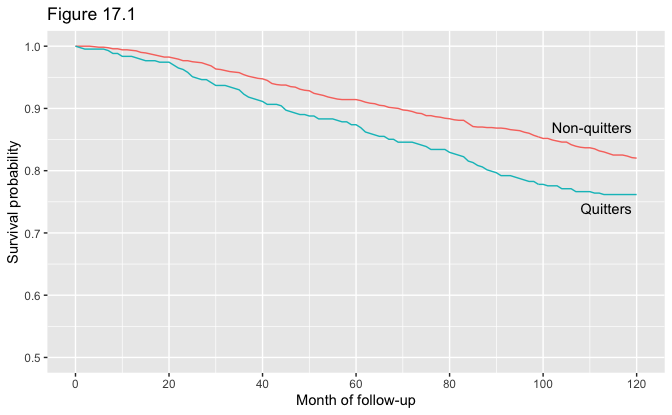
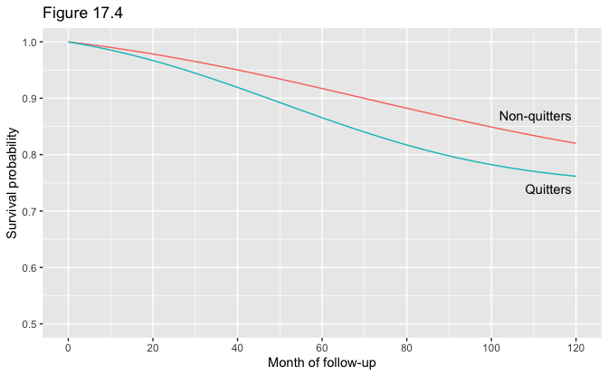
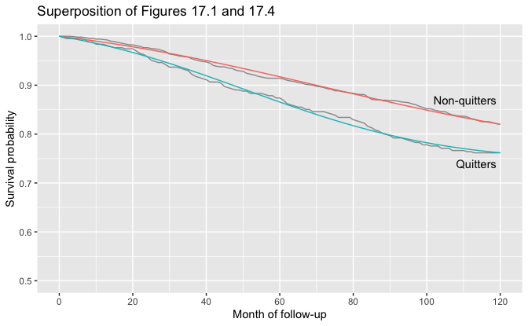
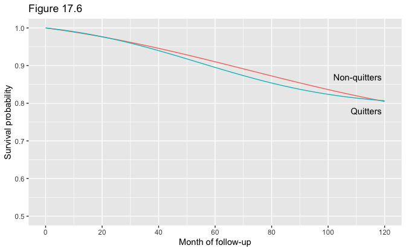
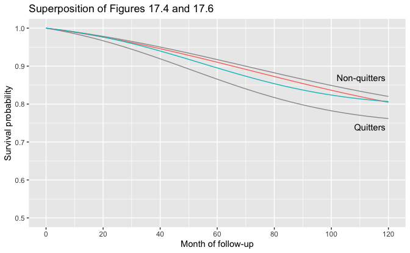
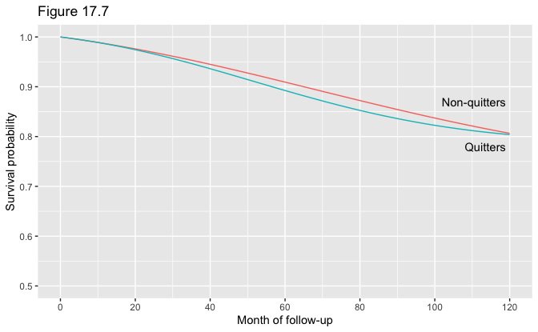
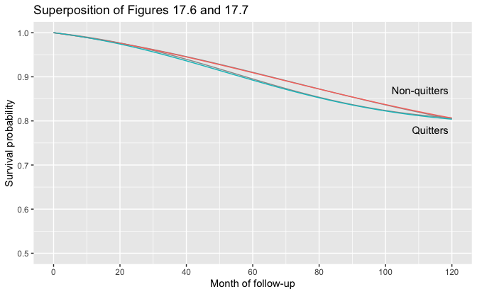

17 Causal survival analysis
================
Bill Behrman
2022-06-16

-   [17.1 Hazards and risks](#171-hazards-and-risks)
-   [17.2 From hazards to risks](#172-from-hazards-to-risks)
-   [17.4 IP weighting of marginal structural
    models](#174-ip-weighting-of-marginal-structural-models)
-   [17.5 The parametric g-formula](#175-the-parametric-g-formula)

``` r
# Packages
library(tidyverse)

# Parameters
  # NHEFS data
file_nhefs <- here::here("data/nhefs.rds")
  # Common code
file_common <- here::here("_common.R")

# Round and format vector
round_format <- function(x, nsmall = 2, ...) {
  format(round(x, digits = nsmall), nsmall = nsmall, ...)
}
# Print tibble
kable <- function(x, cols = everything(), nsmall = 2, align = "r", ...) {
  x %>%
    mutate(across({{cols}}, round_format, nsmall = nsmall)) %>%
    knitr::kable(align = align, ...)
}
# Print min, mean, and max of vector
kable_summary <- function(x, nsmall = 2, ...) {
  tibble(min = min(x), mean = mean(x), max = max(x)) %>%
    kable(nsmall = nsmall, ...)
}

#===============================================================================

# Run common code
source(file_common)

# NHEFS data with `qsmk` as a double
nhefs <- 
  read_rds(file_nhefs) %>% 
  mutate(qsmk = as.double(qsmk) - 1)
```

## 17.1 Hazards and risks

In the following we will use the following variables:

-   `dadth`: Day of death
-   `death`: Death by 1992
    -   0: No
    -   1: Yes
-   `modth`: Month of death
-   `yrdth`: Year of death

Number of people in dataset.

``` r
nrow(nhefs)
```

    #> [1] 1629

Range of ages.

``` r
range(nhefs$age)
```

    #> [1] 25 74

The number of people who died by the end of 1992.

``` r
v <- 
  nhefs %>% 
  count(death)

knitr::kable(v)
```

| death |    n |
|:------|-----:|
| 0     | 1311 |
| 1     |  318 |

Of the 1629 individuals in the dataset, 318 died before the end of 1992,
and the remaining 1311 survived.

The variables `death`, `yrdth`, `modth`, and `dadth`.

``` r
nhefs %>% 
  count(death, !is.na(yrdth), !is.na(modth), !is.na(dadth))
```

    #> # A tibble: 3 × 5
    #>   death `!is.na(yrdth)` `!is.na(modth)` `!is.na(dadth)`     n
    #>   <fct> <lgl>           <lgl>           <lgl>           <int>
    #> 1 0     FALSE           FALSE           FALSE            1307
    #> 2 0     FALSE           TRUE            TRUE                4
    #> 3 1     TRUE            TRUE            TRUE              318

Note that four individuals have months and days of death but no year.
They are classified by the `death` variable as having not died. For the
following, we will assume that the `death` variable is correct.

The follow-up period began on January 1, 1983 and lasted through
December 31, 1992. For those who died, we will add the variable
`time_death` for the month of the follow-up in which they died, ranging
from 1 for January 1983 to 120 for December 1992.

``` r
nhefs <- 
  nhefs %>% 
  mutate(
    time_death = if_else(death == "1", 12 * (yrdth - 83) + modth, NA_real_)
  )
```

Range of values for `time_death`.

``` r
range(nhefs$time_death, na.rm = TRUE)
```

    #> [1]   1 120

Number of individuals who died by whether or not they quit smoking
(`qsmk`).

``` r
v <- 
  nhefs %>% 
  filter(!is.na(time_death)) %>% 
  count(qsmk)

knitr::kable(v)
```

| qsmk |   n |
|-----:|----:|
|    0 | 216 |
|    1 | 102 |

Of the 318 individuals who died, 216 did not quit smoking and 102 did
quit smoking.

For each treatment group (`qsmk`) and each follow-up month, calculate
the cumulative deaths (`deaths_cum`), the number who survived
(`survived`), and the proportion who survived (`survival`).

``` r
time_max <- max(nhefs$time_death, na.rm = TRUE)

survival_1 <- 
  expand_grid(qsmk = 0:1, time = 0:time_max) %>% 
  left_join(
    nhefs %>% 
      filter(death == "1") %>% 
      count(qsmk, time = time_death, name = "deaths"),
    by = c("qsmk", "time")
  ) %>% 
  replace_na(list(deaths = 0)) %>% 
  group_by(qsmk) %>% 
  mutate(
    deaths_cum = cumsum(deaths),
    survived = sum(nhefs$qsmk == first(qsmk)) - deaths_cum,
    survival = survived / sum(nhefs$qsmk == first(qsmk))
  ) %>% 
  ungroup()

survival_1
```

    #> # A tibble: 242 × 6
    #>     qsmk  time deaths deaths_cum survived survival
    #>    <dbl> <dbl>  <int>      <int>    <int>    <dbl>
    #>  1     0     0      0          0     1201    1    
    #>  2     0     1      0          0     1201    1    
    #>  3     0     2      0          0     1201    1    
    #>  4     0     3      0          0     1201    1    
    #>  5     0     4      1          1     1200    0.999
    #>  6     0     5      1          2     1199    0.998
    #>  7     0     6      0          2     1199    0.998
    #>  8     0     7      1          3     1198    0.998
    #>  9     0     8      2          5     1196    0.996
    #> 10     0     9      0          5     1196    0.996
    #> # … with 232 more rows

Figure 17.1.

``` r
survival_plot_details <- function(y_quitters = 0.74) {
  list(
    annotate(
      "text",
      x = 119,
      y = c(0.87, y_quitters),
      hjust = 1,
      label = c("Non-quitters", "Quitters")
    ),
    coord_cartesian(ylim = c(0.5, 1)),
    scale_x_continuous(breaks = scales::breaks_width(20)),
    theme(legend.position = "none"),
    labs(
      x = "Month of follow-up",
      y = "Survival probability"
    )
  )
}

survival_1 %>% 
  ggplot(aes(time, survival, color = as.factor(qsmk))) +
  geom_line() +
  survival_plot_details() +
  labs(title = "Figure 17.1")
```



Log-rank test to compare survival curves.

``` r
test <- 
  nhefs %>% 
  transmute(
    qsmk,
    time = replace_na(time_death, replace = time_max),
    event = as.double(death) - 1
  )  %>% 
  survival::survdiff(
    survival::Surv(time = time, event = event) ~ qsmk,
    data = .
  )

broom::glance(test) %>% 
  select(p_value = p.value) %>% 
  kable(nsmall = 3)
```

| p_value |
|--------:|
|   0.005 |

Survival at 120 months.

``` r
v <- 
  survival_1 %>% 
  filter(time == 120) %>% 
  select(qsmk, survival)

v %>% 
  kable(cols = survival, nsmall = 3)
```

| qsmk | survival |
|-----:|---------:|
|    0 |    0.820 |
|    1 |    0.762 |

Survival at 120 months was 82.0% among non-quitters and 76.2% among
quitters. The risk at 120 months was 18.0% among non-quitters and 23.8%
among quitters.

Hazard at 120 months.

``` r
v <- 
  survival_1 %>% 
  mutate(
    survived_prev = lag(survived),
    hazard = deaths / survived_prev
  ) %>% 
  filter(time == 120) %>% 
  select(qsmk, time, deaths, survived_prev, hazard)

v %>% 
  kable(cols = hazard, nsmall = 4)
```

| qsmk | time | deaths | survived_prev | hazard |
|-----:|-----:|-------:|--------------:|-------:|
|    0 |  120 |      1 |           986 | 0.0010 |
|    1 |  120 |      0 |           326 | 0.0000 |

The hazard at 120 months was 0.10% among non-quitters and 0% among
quitters.

## 17.2 From hazards to risks

Time-event tibble for person in person-time format.

``` r
time_event <- function(death, time_death) {
  stopifnot(death %in% c("0", "1"))
  if (death == "0") {
    tibble(time = seq_len(time_max) - 1, event = 0)
  } else if (death == "1") {
    tibble(
      time = seq_len(time_death) - 1,
      event = rep(0:1, c(time_death - 1, 1))
    )
  }
}
```

NHEFS dataset in person-time format.

``` r
nhefs_pt <- 
  nhefs %>% 
  select(seqn, qsmk, death, time_death) %>% 
  rowwise() %>% 
  mutate(time_event = list(time_event(death, time_death))) %>% 
  unnest(time_event)
```

Number of rows in `nhefs_pt`.

``` r
nrow(nhefs_pt)
```

    #> [1] 176764

Fit logistic regression for hazards.

``` r
fit <- 
  glm(
    event ~ poly(time, 2) + qsmk * poly(time, 2),
    family = binomial(),
    data = nhefs_pt
  )

broom::tidy(fit)
```

    #> # A tibble: 6 × 5
    #>   term                estimate std.error statistic p.value
    #>   <chr>                  <dbl>     <dbl>     <dbl>   <dbl>
    #> 1 (Intercept)           -6.44     0.0698    -92.2   0     
    #> 2 poly(time, 2)1        71.0     30.8         2.30  0.0212
    #> 3 poly(time, 2)2       -56.5     30.1        -1.88  0.0604
    #> 4 qsmk                   0.306    0.125       2.45  0.0145
    #> 5 poly(time, 2)1:qsmk  -99.0     57.3        -1.73  0.0843
    #> 6 poly(time, 2)2:qsmk  -72.6     56.1        -1.29  0.196

Figure 17.4.

``` r
survival_2 <- 
  expand_grid(qsmk = 0:1, time = 0:time_max) %>% 
  group_by(qsmk) %>% 
  mutate(
    survival = 
      cumprod(
        1 - predict(fit, newdata = tibble(qsmk, time), type = "response")
      ) %>% 
      lag(default = 1)
  ) %>% 
  ungroup()

survival_2 %>% 
  ggplot(aes(time, survival, color = as.factor(qsmk))) +
  geom_line() +
  survival_plot_details() +
  labs(title = "Figure 17.4")
```



Superposition of Figures 17.1 and 17.4.

``` r
ggplot(mapping = aes(time, survival)) +
  geom_line(aes(group = qsmk), data = survival_1, color = "grey60") +
  geom_line(aes(color = as.factor(qsmk)), data = survival_2) +
  survival_plot_details() + 
  labs(title = "Superposition of Figures 17.1 and 17.4")
```



## 17.4 IP weighting of marginal structural models

Stabilized IP weights for treatment.

``` r
ip_numerator <- 
  case_when(
    nhefs$qsmk == 0 ~ 1 - mean(nhefs$qsmk),
    nhefs$qsmk == 1 ~ mean(nhefs$qsmk),
    TRUE ~ NA_real_
  )

fit_denominator <- 
  glm(
    qsmk ~ sex + age + I(age^2) + race + education + wt71 + I(wt71^2) +
      smokeintensity + I(smokeintensity^2) + smokeyrs + I(smokeyrs^2) +
      active + exercise,
    family = binomial(),
    data = nhefs
  )

ip_denominator <- 
  case_when(
    nhefs$qsmk == 0 ~ 1 - predict(fit_denominator, type = "response"),
    nhefs$qsmk == 1 ~ predict(fit_denominator, type = "response"),
    TRUE ~ NA_real_
  )

ip_sw_a <- ip_numerator / ip_denominator

kable_summary(ip_sw_a)
```

|  min | mean |  max |
|-----:|-----:|-----:|
| 0.33 | 1.00 | 4.21 |

NHEFS dataset with weights in person-time format.

``` r
nhefs_pt <- 
  nhefs %>% 
  transmute(seqn, qsmk, weight = ip_sw_a, death, time_death) %>% 
  rowwise() %>% 
  mutate(time_event = list(time_event(death, time_death))) %>% 
  unnest(time_event)
```

Fit logistic regression for hazards.

``` r
fit <- 
  glm(
    event ~ poly(time, 2) + qsmk * poly(time, 2),
    family = binomial(),
    data = nhefs_pt,
    weights = weight
  )

broom::tidy(fit)
```

    #> # A tibble: 6 × 5
    #>   term                estimate std.error statistic p.value
    #>   <chr>                  <dbl>     <dbl>     <dbl>   <dbl>
    #> 1 (Intercept)          -6.34      0.0669   -94.8    0     
    #> 2 poly(time, 2)1       73.4      29.5        2.49   0.0128
    #> 3 poly(time, 2)2      -53.2      28.8       -1.85   0.0649
    #> 4 qsmk                 -0.0351    0.135     -0.261  0.794 
    #> 5 poly(time, 2)1:qsmk -82.8      62.0       -1.34   0.181 
    #> 6 poly(time, 2)2:qsmk -94.7      60.9       -1.56   0.120

Figure 17.6.

``` r
survival_3 <- 
  expand_grid(qsmk = 0:1, time = 0:time_max) %>% 
  group_by(qsmk) %>% 
  mutate(
    survival = 
      cumprod(
        1 - predict(fit, newdata = tibble(qsmk, time), type = "response")
      ) %>% 
      lag(default = 1)
  ) %>%
  ungroup()

survival_3 %>% 
  ggplot(aes(time, survival, color = as.factor(qsmk))) +
  geom_line() +
  survival_plot_details(y_quitters = 0.78) +
  labs(title = "Figure 17.6")
```



Superposition of Figures 17.4 and 17.6.

``` r
ggplot(mapping = aes(time, survival)) +
  geom_line(aes(group = qsmk), data = survival_2, color = "grey60") +
  geom_line(aes(color = as.factor(qsmk)), data = survival_3) +
  survival_plot_details() + 
  labs(title = "Superposition of Figures 17.4 and 17.6")
```



Survival at 120 months.

``` r
v <- 
  survival_3 %>% 
  filter(time == 120) %>% 
  select(qsmk, survival)

v %>% 
  kable(cols = survival, nsmall = 3)
```

| qsmk | survival |
|-----:|---------:|
|    0 |    0.805 |
|    1 |    0.807 |

Survival at 120 months was 80.5% among non-quitters and 80.7% among
quitters for a difference of 0.2%.

Calculate survival difference at 120 months and the largest absolute
value of the differences for all months. If `boot = TRUE` (the default),
use bootstrap sample of data. If `boot = FALSE`, use full dataset.

``` r
survival_diff <- function(boot = TRUE) {
  data <-
    nhefs %>%
    transmute(seqn, qsmk, weight = ip_sw_a, death, time_death) %>%
    {
      if (isTRUE(boot)) {
        slice_sample(., prop = 1, replace = TRUE)
      } else {
        .
      }
    } %>%
    rowwise() %>%
    mutate(time_event = list(time_event(death, time_death))) %>%
    unnest(time_event)

  fit <-
    glm(
      event ~ poly(time, 2) + qsmk * poly(time, 2),
      family = binomial(),
      data = data,
      weights = weight
    )

  expand_grid(qsmk = 0:1, time = seq_len(time_max) - 1) %>%
    group_by(qsmk) %>%
    mutate(
      survival =
        cumprod(
          1 - predict(fit, newdata = tibble(qsmk, time), type = "response")
        )
    ) %>%
    ungroup() %>%
    group_by(time) %>%
    summarize(diff = survival[qsmk == 1] - survival[qsmk == 0]) %>%
    summarize(
      last = last(diff),
      max = max(abs(diff))
    )
}
```

Perform bootstrap resampling.

``` r
set.seed(231)

n_boot <- 500

boot_out <-
  seq_len(n_boot) %>%
  map_dfr(~ survival_diff())
```

Survival difference at 120 months with 95% confidence interval
calculated using bootstrap percentile method.

``` r
v <-
  tibble(
    estimate = survival_diff(boot = FALSE)$last,
    conf_low = quantile(boot_out$last, probs = 0.025),
    conf_high = quantile(boot_out$last, probs = 0.975)
  )

kable(v, nsmall = 3)
```

| estimate | conf_low | conf_high |
|---------:|---------:|----------:|
|    0.002 |   -0.046 |     0.046 |

The survival difference at 120 months was 0.2% with a 95% confidence
interval from -4.6% to 4.6% based on 500 bootstrap samples.

The largest absolute value of the differences for all months with 95%
confidence interval calculated using bootstrap percentile method. Note
that this a different measure than the one used in the book.

``` r
v <-
  tibble(
    estimate = survival_diff(boot = FALSE)$max,
    conf_low = quantile(boot_out$max, probs = 0.025),
    conf_high = quantile(boot_out$max, probs = 0.975)
  )

kable(v, nsmall = 3)
```

| estimate | conf_low | conf_high |
|---------:|---------:|----------:|
|    0.019 |    0.009 |     0.060 |

The largest absolute value of the differences for all months was 1.9%
with a 95% confidence interval from 0.9% to 6.0% based on 500 bootstrap
samples.

## 17.5 The parametric g-formula

NHEFS dataset in person-time format.

``` r
nhefs_pt <-
  nhefs %>%
  select(
    qsmk, death, sex, age, race, education, wt71, smokeintensity,
    smkintensity82_71, smokeyrs, active, exercise, time_death
  ) %>%
  rowwise() %>%
  mutate(time_event = list(time_event(death, time_death))) %>%
  unnest(time_event)
```

Fit logistic regression for hazards.

``` r
fit <-
  glm(
    event ~ poly(time, 2) + qsmk * poly(time, 2) + sex + poly(age, 2) + race +
      education + poly(wt71, 2) + poly(smokeintensity, 2) + smkintensity82_71 +
      poly(smokeyrs, 2) + active + exercise,
    family = binomial(),
    data = nhefs_pt
  )

broom::tidy(fit)
```

    #> # A tibble: 25 × 5
    #>    term           estimate std.error statistic   p.value
    #>    <chr>             <dbl>     <dbl>     <dbl>     <dbl>
    #>  1 (Intercept)     -6.70       0.199   -33.7   3.14e-249
    #>  2 poly(time, 2)1 130.        31.2       4.16  3.13e-  5
    #>  3 poly(time, 2)2 -52.9       30.2      -1.75  8.00e-  2
    #>  4 qsmk             0.0296     0.179     0.165 8.69e-  1
    #>  5 sex1            -0.437      0.141    -3.10  1.93e-  3
    #>  6 poly(age, 2)1  392.        64.7       6.06  1.38e-  9
    #>  7 poly(age, 2)2   -4.86      32.7      -0.149 8.82e-  1
    #>  8 race1            0.0524     0.173     0.302 7.63e-  1
    #>  9 education2      -0.140      0.157    -0.895 3.71e-  1
    #> 10 education3      -0.433      0.153    -2.84  4.50e-  3
    #> # … with 15 more rows

Calculate survival curve for individual.

``` r
time_survival <- function(fit, data, qsmk) {
  tibble(
    time = 0:time_max,
    survival =
      cumprod(
        1 - predict(fit, newdata = tibble(data, qsmk, time), type = "response")
      ) %>%
      lag(default = 1)
  )
}
```

Calculate survival curves for each individual and then average.

``` r
survival_4 <-
  nhefs %>%
  select(
    seqn, sex, age, race, education, wt71, smokeintensity, smkintensity82_71,
    smokeyrs, active, exercise
  ) %>%
  expand_grid(qsmk = 0:1) %>%
  nest(data = !c(seqn, qsmk)) %>%
  rowwise() %>%
  transmute(
    qsmk,
    time_survival = list(time_survival(fit = fit, data = data, qsmk = qsmk))
  ) %>%
  unnest(time_survival) %>%
  group_by(qsmk, time) %>%
  summarize(across(survival, mean)) %>%
  ungroup()
```

Figure 17.7.

``` r
survival_4 %>%
  ggplot(aes(time, survival, color = as.factor(qsmk))) +
  geom_line() +
  survival_plot_details(y_quitters = 0.78) +
  labs(title = "Figure 17.7")
```



Superposition of Figures 17.6 and 17.7.

``` r
ggplot(mapping = aes(time, survival)) +
  geom_line(aes(group = qsmk), data = survival_3, color = "grey60") +
  geom_line(aes(color = as.factor(qsmk)), data = survival_4) +
  survival_plot_details(y_quitters = 0.78) +
  labs(title = "Superposition of Figures 17.6 and 17.7")
```



The survival curves from the two figures are coincident.

Survival at 120 months.

``` r
v <-
  survival_4 %>%
  filter(time == 120) %>%
  select(qsmk, survival)

v %>%
  kable(cols = survival, nsmall = 3)
```

| qsmk | survival |
|-----:|---------:|
|    0 |    0.806 |
|    1 |    0.804 |

Survival at 120 months was 80.6% among non-quitters and 80.4% among
quitters for a difference of -0.3% (rounded from -0.253%).

Calculate survival difference at 120 months and the largest absolute
value of the differences for all months. If `boot = TRUE` (the default),
use bootstrap sample of data. If `boot = FALSE`, use full dataset.

``` r
survival_diff <- function(boot = TRUE) {
  v <-
    nhefs %>%
    select(
      qsmk, death, sex, age, race, education, wt71, smokeintensity,
      smkintensity82_71, smokeyrs, active, exercise, time_death
    ) %>%
    {
      if (isTRUE(boot)) {
        slice_sample(., prop = 1, replace = TRUE)
      } else {
        .
      }
    } %>%
    mutate(row = row_number())

  data <-
    v %>%
    rowwise() %>%
    mutate(time_event = list(time_event(death, time_death))) %>%
    unnest(time_event)

  fit <-
    glm(
      event ~ poly(time, 2) + qsmk * poly(time, 2) + sex + poly(age, 2) + race +
        education + poly(wt71, 2) + poly(smokeintensity, 2) +
        smkintensity82_71 + poly(smokeyrs, 2) + active + exercise,
      family = binomial(),
      data = data
    )

  v %>%
    select(!c(qsmk, death, time_death)) %>%
    expand_grid(qsmk = 0:1) %>%
    nest(data = !c(row, qsmk)) %>%
    rowwise() %>%
    transmute(
      qsmk,
      time_survival = list(time_survival(fit = fit, data = data, qsmk = qsmk))
    ) %>%
    unnest(time_survival) %>%
    group_by(qsmk, time) %>%
    summarize(across(survival, mean)) %>%
    ungroup() %>%
    group_by(time) %>%
    summarize(diff = survival[qsmk == 1] - survival[qsmk == 0]) %>%
    summarize(
      last = last(diff),
      max = max(abs(diff))
    )
}
```

Perform bootstrap resampling.

``` r
set.seed(231)

n_boot <- 100

boot_out <-
  seq_len(n_boot) %>%
  map_dfr(~ survival_diff())
```

Survival difference at 120 months with 95% confidence interval
calculated using bootstrap percentile method.

``` r
v <-
  tibble(
    estimate = survival_diff(boot = FALSE)$last,
    conf_low = quantile(boot_out$last, probs = 0.025),
    conf_high = quantile(boot_out$last, probs = 0.975)
  )

kable(v, nsmall = 3)
```

| estimate | conf_low | conf_high |
|---------:|---------:|----------:|
|   -0.003 |   -0.046 |     0.042 |

The survival difference at 120 months was -0.3% with a 95% confidence
interval from -4.6% to 4.2% based on 100 bootstrap samples.

The largest absolute value of the differences for all months with 95%
confidence interval calculated using bootstrap percentile method. Note
that this a different measure than the one used in the book.

``` r
v <-
  tibble(
    estimate = survival_diff(boot = FALSE)$max,
    conf_low = quantile(boot_out$max, probs = 0.025),
    conf_high = quantile(boot_out$max, probs = 0.975)
  )

kable(v, nsmall = 3)
```

| estimate | conf_low | conf_high |
|---------:|---------:|----------:|
|    0.020 |    0.008 |     0.057 |

The largest absolute value of the differences for all months was 2.0%
with a 95% confidence interval from 0.8% to 5.7% based on 100 bootstrap
samples.
