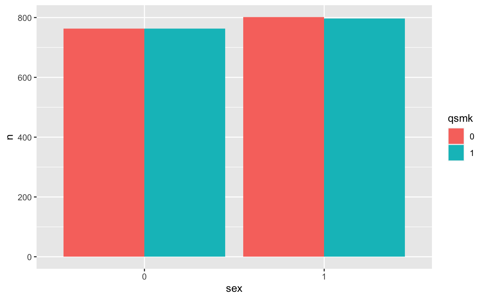
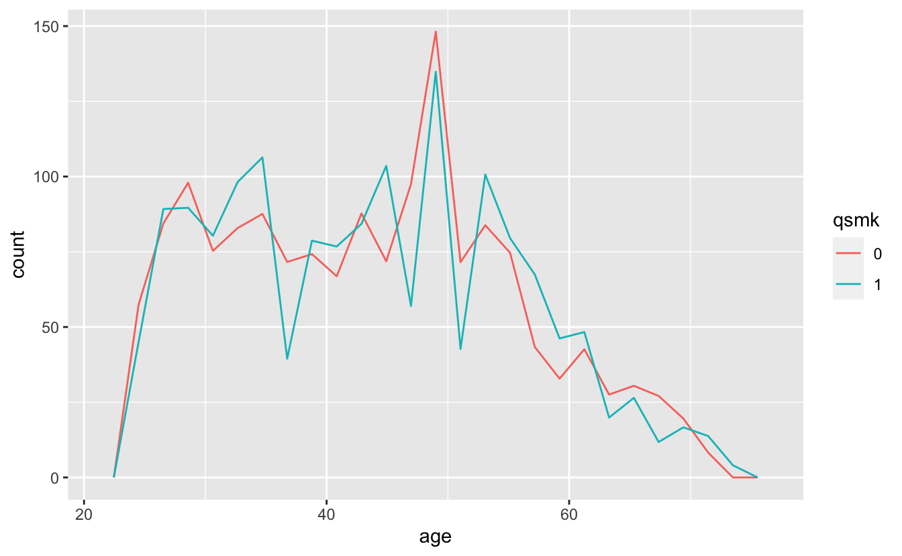
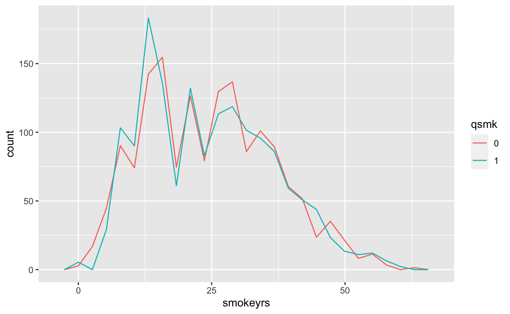
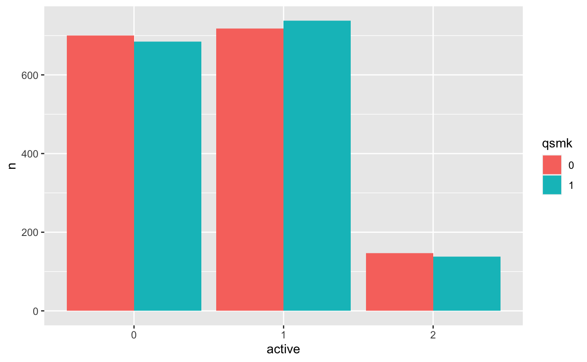
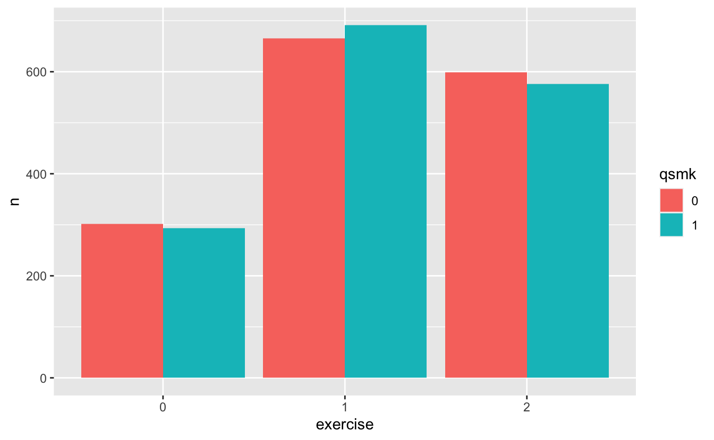
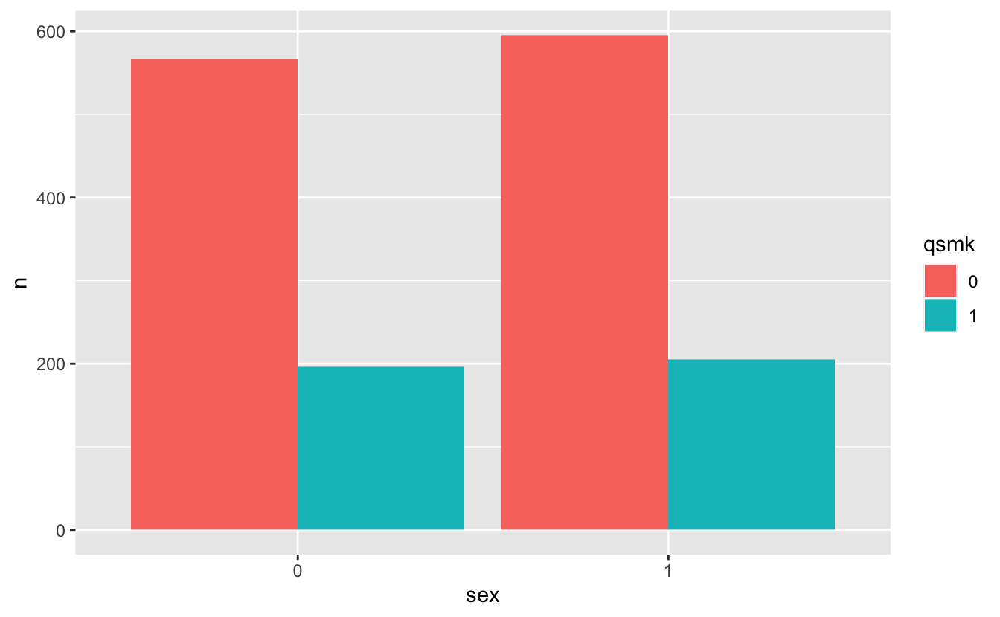
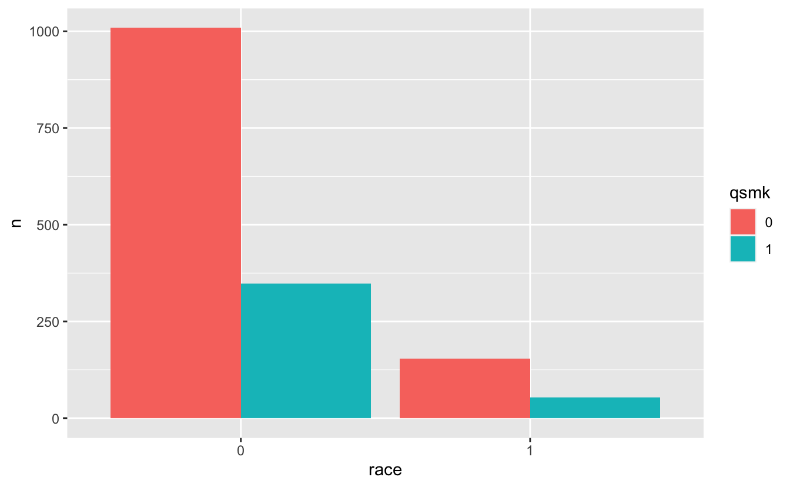
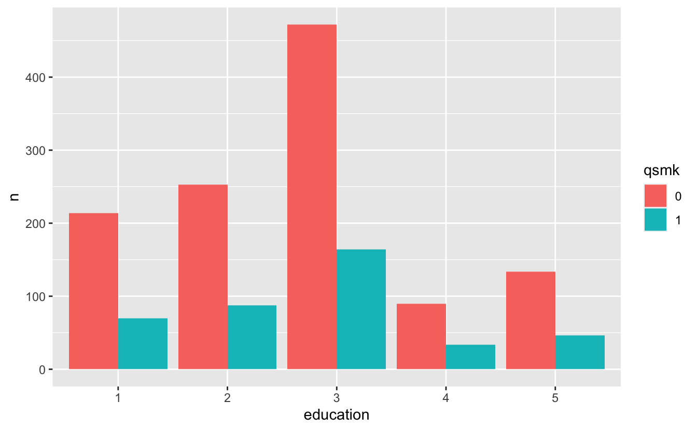
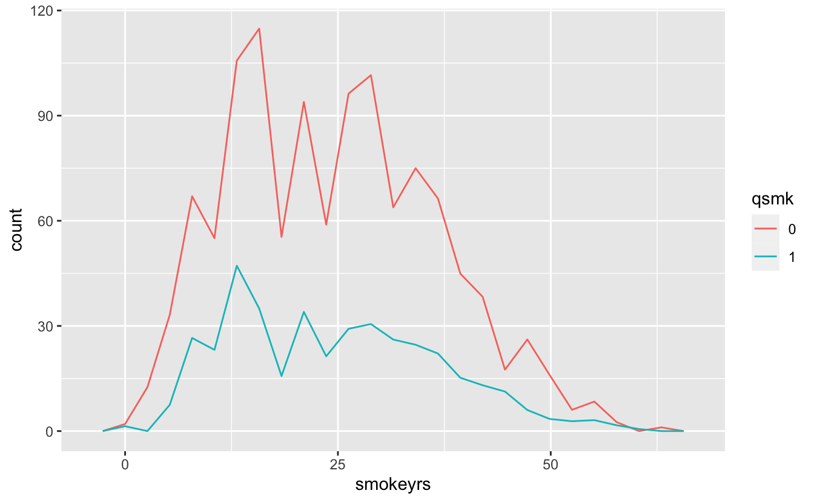
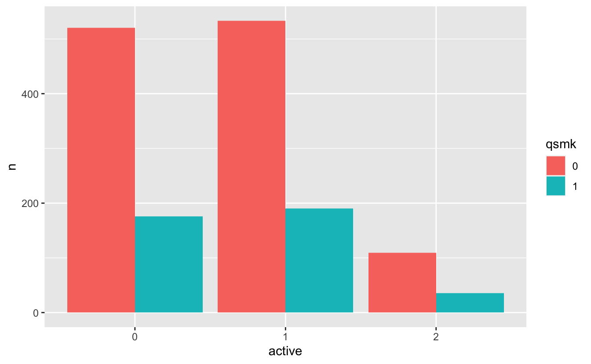

# 12 IP weighting and marginal structural models {-}


```r
# Packages
library(tidyverse)

# Parameters
  # NHEFS data
file_nhefs <- here::here("data/nhefs.rds")

# Round and format vector
round_format <- function(x, nsmall = 2, ...) {
  format(round(x, digits = nsmall), nsmall = nsmall, ...)
}
# Print tibble
kable <- function(x, cols = where(is.double), nsmall = 2, align = "r", ...) {
  x %>%
    mutate(across({{cols}}, round_format, nsmall = nsmall)) %>%
    knitr::kable(align = align, ...) %>% 
    kableExtra::kable_styling(full_width = FALSE, position = "left")
}
# Print min, mean, and max of vector
kable_summary <- function(x, nsmall = 2, ...) {
  tibble(min = min(x), mean = mean(x), max = max(x)) %>%
    kable(nsmall = nsmall, ...)
}

#===============================================================================

# NHEFS data
nhefs <- read_rds(file_nhefs)

# NHEFS censored for those with weight measurements in 1982
nhefs_censored <- 
  nhefs %>% 
  drop_na(wt82, wt82_71)
```

## 12.1 The causal question {-}

The data are from the [National Health and Nutrition Examination Survey 1 Epidemiologic Follow-up Study](https://wwwn.cdc.gov/nchs/nhanes/nhefs/) (NHEFS). The data are drawn from two questionnaires, one taken in 1971 and the other in 1982. Below we will be using these variables:

* `active`: In your usual day, how active are you? in 1971
  * 0: Very active
  * 1: Moderately active
  * 2: Inactive
* `age`: Age in 1971
* `death`: Death by 1992
  * 0: No
  * 1: Yes
* `education`: Amount of education by 1971
  * 1: 8th grade or less
  * 2: High school dropout
  * 3: High school
  * 4: College dropout
  * 5: College or more
* `exercise`: In recreation, how much exercise? in 1971
  * 0: Much exercise
  * 1: Moderate exercise
  * 2: Little or no exercise
* `qsmk`: Quit smoking between 1971 and 1982 questionnaires
  * 0: No
  * 1: Yes
* `race`: Race in 1971
  * 0: White
  * 1: Black or other
* `sex`: Sex
  * 0: Male
  * 1: Female
* `smokeintensity`: Number of cigarettes smoked per day in 1971
* `smokeintensity82_71`: Increase in number of cigarettes smoked per day between 1971 and 1982
* `smokeyrs`: Years of smoking
* `wt71`: Weight in 1971 (kilograms)
* `wt82`: Weight in 1982 (kilograms)
* `wt82_71`: Weight change between 1971 and 1982 (kilograms)

The causal question is: What is the average causal effect of smoking cessation (`qsmk`) on weight gain (`wt82_71`)?

In the following, we will examine the censored dataset of those with weight measurements in 1982. Number of people in dataset.


```r
nrow(nhefs_censored)
```

```
#> [1] 1566
```

Range of ages.


```r
range(nhefs_censored$age)
```

```
#> [1] 25 74
```

Average weight gains in quitters and non-quitters.


```r
v <- 
  nhefs_censored %>% 
  group_by(qsmk) %>% 
  summarize(across(wt82_71, mean))

kable(v, nsmall = 1)
```

<table class="table" style="width: auto !important; ">
 <thead>
  <tr>
   <th style="text-align:right;"> qsmk </th>
   <th style="text-align:right;"> wt82_71 </th>
  </tr>
 </thead>
<tbody>
  <tr>
   <td style="text-align:right;"> 0 </td>
   <td style="text-align:right;"> 2.0 </td>
  </tr>
  <tr>
   <td style="text-align:right;"> 1 </td>
   <td style="text-align:right;"> 4.5 </td>
  </tr>
</tbody>
</table>

The average weight gain was 2.0 kg in non-quitters and 4.5 kg in quitters.

Create a simple linear model to get an estimate the difference in average weight gains with a 95% confidence interval.


```r
fit <- lm(wt82_71 ~ qsmk, data = nhefs_censored)

broom::tidy(fit, conf.int = TRUE) %>% 
  filter(term == "qsmk1") %>% 
  select(estimate, conf_low = conf.low, conf_high = conf.high) %>% 
  kable(nsmall = 1)
```

<table class="table" style="width: auto !important; ">
 <thead>
  <tr>
   <th style="text-align:right;"> estimate </th>
   <th style="text-align:right;"> conf_low </th>
   <th style="text-align:right;"> conf_high </th>
  </tr>
 </thead>
<tbody>
  <tr>
   <td style="text-align:right;"> 2.5 </td>
   <td style="text-align:right;"> 1.7 </td>
   <td style="text-align:right;"> 3.4 </td>
  </tr>
</tbody>
</table>

Table 12.1.


```r
var_descriptions <- 
  c(
    age = "Age (years)",
    male = "Men (%)",
    white = "White (%)",
    university = "University (%)",
    wt71 = "Weight (kg)",
    smokeintensity = "Cigarettes per day",
    smokeyrs = "Years smoking",
    little_exercise = "Little exercise (%)",
    inactive = "Inactive life (%)"
  )

nhefs_censored %>% 
  transmute(
    qsmk,
    age,
    male = sex == "0",
    white = race == "0",
    university = education == "5",
    wt71,
    smokeintensity,
    smokeyrs,
    little_exercise = exercise == "2",
    inactive = active == "2"
  ) %>% 
  group_by(qsmk) %>% 
  summarize(across(everything(), mean)) %>% 
  mutate(
    across(c(male, white, university, little_exercise, inactive), ~ 100 * .)
  ) %>% 
  pivot_longer(cols = !qsmk, names_to = "Mean baseline characteristics") %>% 
  pivot_wider(names_from = qsmk, names_prefix = "A = ") %>% 
  mutate(across(`Mean baseline characteristics`, ~ var_descriptions[.])) %>% 
  relocate(`A = 0`, .after = `A = 1`) %>%
  kable(nsmall = 1, align = "lrr")
```

<table class="table" style="width: auto !important; ">
 <thead>
  <tr>
   <th style="text-align:left;"> Mean baseline characteristics </th>
   <th style="text-align:right;"> A = 1 </th>
   <th style="text-align:right;"> A = 0 </th>
  </tr>
 </thead>
<tbody>
  <tr>
   <td style="text-align:left;"> Age (years) </td>
   <td style="text-align:right;"> 46.2 </td>
   <td style="text-align:right;"> 42.8 </td>
  </tr>
  <tr>
   <td style="text-align:left;"> Men (%) </td>
   <td style="text-align:right;"> 54.6 </td>
   <td style="text-align:right;"> 46.6 </td>
  </tr>
  <tr>
   <td style="text-align:left;"> White (%) </td>
   <td style="text-align:right;"> 91.1 </td>
   <td style="text-align:right;"> 85.4 </td>
  </tr>
  <tr>
   <td style="text-align:left;"> University (%) </td>
   <td style="text-align:right;"> 15.4 </td>
   <td style="text-align:right;"> 9.9 </td>
  </tr>
  <tr>
   <td style="text-align:left;"> Weight (kg) </td>
   <td style="text-align:right;"> 72.4 </td>
   <td style="text-align:right;"> 70.3 </td>
  </tr>
  <tr>
   <td style="text-align:left;"> Cigarettes per day </td>
   <td style="text-align:right;"> 18.6 </td>
   <td style="text-align:right;"> 21.2 </td>
  </tr>
  <tr>
   <td style="text-align:left;"> Years smoking </td>
   <td style="text-align:right;"> 26.0 </td>
   <td style="text-align:right;"> 24.1 </td>
  </tr>
  <tr>
   <td style="text-align:left;"> Little exercise (%) </td>
   <td style="text-align:right;"> 40.7 </td>
   <td style="text-align:right;"> 37.9 </td>
  </tr>
  <tr>
   <td style="text-align:left;"> Inactive life (%) </td>
   <td style="text-align:right;"> 11.2 </td>
   <td style="text-align:right;"> 8.9 </td>
  </tr>
</tbody>
</table>

## 12.2 Estimating IP weights via modeling {-}

Fit logistic regression model for propensity scores.


```r
fit <- 
  glm(
    qsmk ~ sex + poly(age, 2) + race + education + poly(wt71, 2) +
      poly(smokeintensity, 2) + poly(smokeyrs, 2) + active + exercise,
    family = binomial(),
    data = nhefs_censored
  )
```

Non-stabilized IP weights for treatment.


```r
ip_w_a <- 
  case_when(
    nhefs_censored$qsmk == "0" ~ 1 / (1 - predict(fit, type = "response")),
    nhefs_censored$qsmk == "1" ~ 1 / predict(fit, type = "response"),
    TRUE ~ NA_real_
  )

kable_summary(ip_w_a)
```

<table class="table" style="width: auto !important; ">
 <thead>
  <tr>
   <th style="text-align:right;"> min </th>
   <th style="text-align:right;"> mean </th>
   <th style="text-align:right;"> max </th>
  </tr>
 </thead>
<tbody>
  <tr>
   <td style="text-align:right;"> 1.05 </td>
   <td style="text-align:right;"> 2.00 </td>
   <td style="text-align:right;"> 16.70 </td>
  </tr>
</tbody>
</table>

Estimate average treatment effect (ATE) using weighted least squares. This is a valid method for estimating the ATE but not its standard error.


```r
fit_lm <- lm(wt82_71 ~ qsmk, data = nhefs_censored, weights = ip_w_a)

broom::tidy(fit_lm)
```

```
#> # A tibble: 2 × 5
#>   term        estimate std.error statistic  p.value
#>   <chr>          <dbl>     <dbl>     <dbl>    <dbl>
#> 1 (Intercept)     1.78     0.288      6.18 8.40e-10
#> 2 qsmk1           3.44     0.408      8.43 7.47e-17
```

Estimate ATE and its standard error using generalized estimating equation model.


```r
fit_geeglm <- 
  geepack::geeglm(
    wt82_71 ~ qsmk, data = nhefs_censored, weights = ip_w_a, id = seqn
  )

broom::tidy(fit_geeglm)
```

```
#> # A tibble: 2 × 5
#>   term        estimate std.error statistic  p.value
#>   <chr>          <dbl>     <dbl>     <dbl>    <dbl>
#> 1 (Intercept)     1.78     0.225      62.7 2.33e-15
#> 2 qsmk1           3.44     0.525      42.9 5.86e-11
```

The two estimates for the ATE are very close.


```r
ate_lm <- coef(fit_lm)[["qsmk1"]]
ate_geeglm <- coef(fit_geeglm)[["qsmk1"]]

ate_lm - ate_geeglm
```

```
#> [1] 3.996803e-15
```

Estimate of ATE with 95% confidence interval.


```r
v <- 
  broom::tidy(fit_geeglm, conf.int = TRUE) %>% 
  filter(term == "qsmk1") %>% 
  select(estimate, conf_low = conf.low, conf_high = conf.high)

kable(v, nsmall = 1)
```

<table class="table" style="width: auto !important; ">
 <thead>
  <tr>
   <th style="text-align:right;"> estimate </th>
   <th style="text-align:right;"> conf_low </th>
   <th style="text-align:right;"> conf_high </th>
  </tr>
 </thead>
<tbody>
  <tr>
   <td style="text-align:right;"> 3.4 </td>
   <td style="text-align:right;"> 2.4 </td>
   <td style="text-align:right;"> 4.5 </td>
  </tr>
</tbody>
</table>


Plot treatment levels for each confounder.


```r
plot_treatment <- function(var, weights, bins = 25) {
  v <- 
    nhefs_censored %>% 
    mutate(weights = weights) %>% 
    count({{var}}, qsmk, wt = weights)
  
  if (is.factor(pull(nhefs_censored, {{var}}))) {
    v %>% 
      ggplot(aes({{var}}, n)) +
      geom_col(aes(fill = qsmk), position = "dodge")
  } else if (is.numeric(pull(nhefs_censored, {{var}}))) {
    v %>% 
      ggplot(aes({{var}})) +
      geom_freqpoly(aes(color = qsmk, weight = n), bins = bins)
  } else {
    NULL
  }
}

confounders <- 
  vars(
    sex, age, race, education, smokeintensity, smokeyrs, active, exercise, wt71
  )

confounders %>%
  map(plot_treatment, weights = ip_w_a) %>% 
  walk(print)
```



In the pseudo-population with nonstabilized IP weighting, the treatment populations are roughly equal.

## 12.3 Stabilized IP weights {-}

Stabilized IP weights for treatment.


```r
ip_sw_a <- 
  case_when(
    nhefs_censored$qsmk == "0" ~ 1 - mean(nhefs_censored$qsmk == "1"),
    nhefs_censored$qsmk == "1" ~ mean(nhefs_censored$qsmk == "1"),
    TRUE ~ NA_real_
  ) * 
  ip_w_a

kable_summary(ip_sw_a)
```

<table class="table" style="width: auto !important; ">
 <thead>
  <tr>
   <th style="text-align:right;"> min </th>
   <th style="text-align:right;"> mean </th>
   <th style="text-align:right;"> max </th>
  </tr>
 </thead>
<tbody>
  <tr>
   <td style="text-align:right;"> 0.33 </td>
   <td style="text-align:right;"> 1.00 </td>
   <td style="text-align:right;"> 4.30 </td>
  </tr>
</tbody>
</table>

Estimate ATE and its standard error using generalized estimating equation model.


```r
fit_geeglm <- 
  geepack::geeglm(
    wt82_71 ~ qsmk, data = nhefs_censored, weights = ip_sw_a, id = seqn
  )

broom::tidy(fit_geeglm)
```

```
#> # A tibble: 2 × 5
#>   term        estimate std.error statistic  p.value
#>   <chr>          <dbl>     <dbl>     <dbl>    <dbl>
#> 1 (Intercept)     1.78     0.225      62.7 2.33e-15
#> 2 qsmk1           3.44     0.525      42.9 5.86e-11
```

Estimate of ATE with 95% confidence interval.


```r
v <- 
  broom::tidy(fit_geeglm, conf.int = TRUE) %>% 
  filter(term == "qsmk1") %>% 
  select(estimate, conf_low = conf.low, conf_high = conf.high)

kable(v, nsmall = 1)
```

<table class="table" style="width: auto !important; ">
 <thead>
  <tr>
   <th style="text-align:right;"> estimate </th>
   <th style="text-align:right;"> conf_low </th>
   <th style="text-align:right;"> conf_high </th>
  </tr>
 </thead>
<tbody>
  <tr>
   <td style="text-align:right;"> 3.4 </td>
   <td style="text-align:right;"> 2.4 </td>
   <td style="text-align:right;"> 4.5 </td>
  </tr>
</tbody>
</table>


Plot treatment levels for each confounder.


```r
confounders %>%
  map(plot_treatment, weights = ip_sw_a) %>% 
  walk(print)
```



In the pseudo-population with stabilized IP weighting, the treatment populations are now unequal. These populations reflect the fact that approximately 74.3% of the participants did not quit smoking (`qsmk` = 0) and 25.7% of the participants did (`qsmk` = 1).

### Fine Point 12.2 Checking positivity {-}

Count number of individuals in all combinations of `sex`, `age`, and `qsmk`.


```r
v <- 
  nhefs_censored %>% 
  expand(sex, age = full_seq(age, period = 1), qsmk) %>% 
  left_join(
    nhefs_censored %>% 
      mutate(n = 1),
    by = c("sex", "age", "qsmk")
  ) %>% 
  count(sex, age, qsmk, wt = n)

v
```

```
#> # A tibble: 200 × 4
#>    sex     age qsmk      n
#>    <fct> <dbl> <fct> <dbl>
#>  1 0        25 0        20
#>  2 0        25 1         6
#>  3 0        26 0        21
#>  4 0        26 1         5
#>  5 0        27 0        11
#>  6 0        27 1         5
#>  7 0        28 0        22
#>  8 0        28 1         3
#>  9 0        29 0        18
#> 10 0        29 1         2
#> # … with 190 more rows
#> # ℹ Use `print(n = ...)` to see more rows
```

Number of combinations by number of individuals in combination.


```r
v %>% 
  ggplot(aes(n)) +
  geom_bar() +
  labs(
    title = "Number of combinations by number of individuals in combination",
    x = "Number of individuals in combination",
    y = "Number of combinations"
  )
```


Eleven combinations have no individuals.


```r
v %>%
  filter(n == 0) %>% 
  kable(nsmall = 0)
```

<table class="table" style="width: auto !important; ">
 <thead>
  <tr>
   <th style="text-align:right;"> sex </th>
   <th style="text-align:right;"> age </th>
   <th style="text-align:right;"> qsmk </th>
   <th style="text-align:right;"> n </th>
  </tr>
 </thead>
<tbody>
  <tr>
   <td style="text-align:right;"> 0 </td>
   <td style="text-align:right;"> 71 </td>
   <td style="text-align:right;"> 1 </td>
   <td style="text-align:right;"> 0 </td>
  </tr>
  <tr>
   <td style="text-align:right;"> 0 </td>
   <td style="text-align:right;"> 73 </td>
   <td style="text-align:right;"> 0 </td>
   <td style="text-align:right;"> 0 </td>
  </tr>
  <tr>
   <td style="text-align:right;"> 0 </td>
   <td style="text-align:right;"> 73 </td>
   <td style="text-align:right;"> 1 </td>
   <td style="text-align:right;"> 0 </td>
  </tr>
  <tr>
   <td style="text-align:right;"> 0 </td>
   <td style="text-align:right;"> 74 </td>
   <td style="text-align:right;"> 0 </td>
   <td style="text-align:right;"> 0 </td>
  </tr>
  <tr>
   <td style="text-align:right;"> 1 </td>
   <td style="text-align:right;"> 66 </td>
   <td style="text-align:right;"> 1 </td>
   <td style="text-align:right;"> 0 </td>
  </tr>
  <tr>
   <td style="text-align:right;"> 1 </td>
   <td style="text-align:right;"> 67 </td>
   <td style="text-align:right;"> 1 </td>
   <td style="text-align:right;"> 0 </td>
  </tr>
  <tr>
   <td style="text-align:right;"> 1 </td>
   <td style="text-align:right;"> 68 </td>
   <td style="text-align:right;"> 1 </td>
   <td style="text-align:right;"> 0 </td>
  </tr>
  <tr>
   <td style="text-align:right;"> 1 </td>
   <td style="text-align:right;"> 71 </td>
   <td style="text-align:right;"> 0 </td>
   <td style="text-align:right;"> 0 </td>
  </tr>
  <tr>
   <td style="text-align:right;"> 1 </td>
   <td style="text-align:right;"> 73 </td>
   <td style="text-align:right;"> 0 </td>
   <td style="text-align:right;"> 0 </td>
  </tr>
  <tr>
   <td style="text-align:right;"> 1 </td>
   <td style="text-align:right;"> 73 </td>
   <td style="text-align:right;"> 1 </td>
   <td style="text-align:right;"> 0 </td>
  </tr>
  <tr>
   <td style="text-align:right;"> 1 </td>
   <td style="text-align:right;"> 74 </td>
   <td style="text-align:right;"> 0 </td>
   <td style="text-align:right;"> 0 </td>
  </tr>
</tbody>
</table>

## 12.4 Marginal structural models {-}

In this section, we will estimate the causal effect of the change in smoking intensity (`smkintensity82_71`), a continuous variable, on the average weight gain (`wt82_71`).

Distribution of `smokeintensity`.


```r
nhefs_censored %>% 
  ggplot(aes(smokeintensity)) +
  geom_histogram(binwidth = 5, boundary = 0) +
  labs(title = "Distribution of smokeintensity")
```


Create subset of data with individuals who smoked 25 or fewer cigarettes per day at baseline.


```r
nhefs_censored_smoke_25 <- 
  nhefs_censored %>% 
  filter(smokeintensity <= 25)
```

Number of individuals in subset.


```r
nrow(nhefs_censored_smoke_25)
```

```
#> [1] 1162
```

Numerator for IP weights.


```r
treatment <- nhefs_censored_smoke_25$smkintensity82_71

ip_numerator <- 
  dnorm(treatment, mean = mean(treatment), sd = sd(treatment))
```

The numerator for the IP weights approximates `smkintensity82_71` with a normal distribution. Here is the actual distribution of `smkintensity82_71` with its normal approximation.


```r
normal_approx <-
  tibble(
    x = seq(min(treatment), max(treatment), length.out = 201),
    y = dnorm(x, mean = mean(treatment), sd = sd(treatment))
  )

nhefs_censored_smoke_25 %>% 
  ggplot() +
  geom_histogram(
    aes(smkintensity82_71, stat(density)),
    binwidth = 5,
    boundary = 0
  ) +
  geom_line(aes(x, y), data = normal_approx, color = "red") +
  labs(
    title = "Distribution of smokeintensity82_71",
    subtitle = "With normal approximation in red"
  )
```


Denominator for IP weights.


```r
fit <- 
  lm(
    smkintensity82_71 ~ sex + poly(age, 2) + race + education + poly(wt71, 2) +
      poly(smokeintensity, 2) + poly(smokeyrs, 2) + active + exercise,
    data = nhefs_censored_smoke_25
  )

ip_denominator <- 
  dnorm(treatment, mean = predict(fit, type = "response"), sd = sigma(fit))
```

IP weights for marginal structural model.


```r
ip_msm <- ip_numerator / ip_denominator

kable_summary(ip_msm)
```

<table class="table" style="width: auto !important; ">
 <thead>
  <tr>
   <th style="text-align:right;"> min </th>
   <th style="text-align:right;"> mean </th>
   <th style="text-align:right;"> max </th>
  </tr>
 </thead>
<tbody>
  <tr>
   <td style="text-align:right;"> 0.19 </td>
   <td style="text-align:right;"> 1.00 </td>
   <td style="text-align:right;"> 5.10 </td>
  </tr>
</tbody>
</table>

Fit marginal structural model.


```r
fit <- 
  geepack::geeglm(
    wt82_71 ~ smkintensity82_71 + I(smkintensity82_71^2),
    data = nhefs_censored_smoke_25,
    weights = ip_msm,
    id = seqn
  )

broom::tidy(fit)
```

```
#> # A tibble: 3 × 5
#>   term                   estimate std.error statistic  p.value
#>   <chr>                     <dbl>     <dbl>     <dbl>    <dbl>
#> 1 (Intercept)             2.00      0.295       46.1  1.10e-11
#> 2 smkintensity82_71      -0.109     0.0315      11.9  5.48e- 4
#> 3 I(smkintensity82_71^2)  0.00269   0.00242      1.24 2.65e- 1
```

Coefficients of model.


```r
broom::tidy(fit) %>% 
  select(term, estimate) %>% 
  kable(nsmall = 3, align = "lr")
```

<table class="table" style="width: auto !important; ">
 <thead>
  <tr>
   <th style="text-align:left;"> term </th>
   <th style="text-align:right;"> estimate </th>
  </tr>
 </thead>
<tbody>
  <tr>
   <td style="text-align:left;"> (Intercept) </td>
   <td style="text-align:right;"> 2.005 </td>
  </tr>
  <tr>
   <td style="text-align:left;"> smkintensity82_71 </td>
   <td style="text-align:right;"> -0.109 </td>
  </tr>
  <tr>
   <td style="text-align:left;"> I(smkintensity82_71^2) </td>
   <td style="text-align:right;"> 0.003 </td>
  </tr>
</tbody>
</table>

Mean weight gain with 95% confidence interval for constant smoking intensity.


```r
broom::tidy(fit, conf.int = TRUE) %>% 
  filter(term == "(Intercept)") %>% 
  select(estimate, conf_low = conf.low, conf_high = conf.high) %>% 
  kable(nsmall = 1)
```

<table class="table" style="width: auto !important; ">
 <thead>
  <tr>
   <th style="text-align:right;"> estimate </th>
   <th style="text-align:right;"> conf_low </th>
   <th style="text-align:right;"> conf_high </th>
  </tr>
 </thead>
<tbody>
  <tr>
   <td style="text-align:right;"> 2.0 </td>
   <td style="text-align:right;"> 1.4 </td>
   <td style="text-align:right;"> 2.6 </td>
  </tr>
</tbody>
</table>

Mean weight gain with 95% confidence interval for increase in smoking intensity of 20 cigarettes per day.


```r
fit <- 
  geepack::geeglm(
    wt82_71 ~ I(smkintensity82_71 - 20) + I((smkintensity82_71 - 20)^2),
    data = nhefs_censored_smoke_25,
    weights = ip_msm,
    id = seqn
  )

broom::tidy(fit, conf.int = TRUE) %>% 
  filter(term == "(Intercept)") %>% 
  select(estimate, conf_low = conf.low, conf_high = conf.high) %>% 
  kable(nsmall = 1)
```

<table class="table" style="width: auto !important; ">
 <thead>
  <tr>
   <th style="text-align:right;"> estimate </th>
   <th style="text-align:right;"> conf_low </th>
   <th style="text-align:right;"> conf_high </th>
  </tr>
 </thead>
<tbody>
  <tr>
   <td style="text-align:right;"> 0.9 </td>
   <td style="text-align:right;"> -1.7 </td>
   <td style="text-align:right;"> 3.5 </td>
  </tr>
</tbody>
</table>

Marginal structural model for causal effect of quitting smoking (`qsmk`) on the risk of death by 1992 (`death`). For this calculation, we will convert the type of `qsmk` and `death` from factor to double.


```r
fit <- 
  nhefs_censored %>% 
  mutate(across(c(qsmk, death), ~ as.double(.) - 1)) %>%
  geepack::geeglm(
    death ~ qsmk, family = binomial(), data = ., weights = ip_sw_a, id = seqn
  )

broom::tidy(fit)
```

```
#> # A tibble: 2 × 5
#>   term        estimate std.error statistic p.value
#>   <chr>          <dbl>     <dbl>     <dbl>   <dbl>
#> 1 (Intercept)  -1.49      0.0789  356.       0    
#> 2 qsmk          0.0301    0.157     0.0367   0.848
```

Estimate of causal odds ratio with 95% confidence interval.


```r
broom::tidy(fit, conf.int = TRUE, exponentiate = TRUE) %>% 
  filter(term == "qsmk") %>% 
  select(estimate, conf_low = conf.low, conf_high = conf.high) %>% 
  kable(nsmall = 1)
```

<table class="table" style="width: auto !important; ">
 <thead>
  <tr>
   <th style="text-align:right;"> estimate </th>
   <th style="text-align:right;"> conf_low </th>
   <th style="text-align:right;"> conf_high </th>
  </tr>
 </thead>
<tbody>
  <tr>
   <td style="text-align:right;"> 1.0 </td>
   <td style="text-align:right;"> 0.8 </td>
   <td style="text-align:right;"> 1.4 </td>
  </tr>
</tbody>
</table>

## 12.5 Effect modification and marginal structural models {-}

IP weights.


```r
fit <- glm(qsmk ~ sex, family = binomial(), data = nhefs_censored)

ip_sw_a <- 
  case_when(
    nhefs_censored$qsmk == "0" ~ (1 - predict(fit, type = "response")),
    nhefs_censored$qsmk == "1" ~ predict(fit, type = "response"),
    TRUE ~ NA_real_
  ) *
  ip_w_a

kable_summary(ip_sw_a)
```

<table class="table" style="width: auto !important; ">
 <thead>
  <tr>
   <th style="text-align:right;"> min </th>
   <th style="text-align:right;"> mean </th>
   <th style="text-align:right;"> max </th>
  </tr>
 </thead>
<tbody>
  <tr>
   <td style="text-align:right;"> 0.29 </td>
   <td style="text-align:right;"> 1.00 </td>
   <td style="text-align:right;"> 3.80 </td>
  </tr>
</tbody>
</table>

Fit marginal structural model.


```r
fit <- 
  geepack::geeglm(
    wt82_71 ~ qsmk * sex, data = nhefs_censored, weights = ip_sw_a, id = seqn
  )

broom::tidy(fit)
```

```
#> # A tibble: 4 × 5
#>   term        estimate std.error statistic       p.value
#>   <chr>          <dbl>     <dbl>     <dbl>         <dbl>
#> 1 (Intercept)  1.78        0.310 33.2      0.00000000845
#> 2 qsmk1        3.52        0.657 28.7      0.0000000832 
#> 3 sex1        -0.00872     0.449  0.000378 0.984        
#> 4 qsmk1:sex1  -0.159       1.05   0.0232   0.879
```

Estimate of effect modification by sex.


```r
broom::tidy(fit, conf.int = TRUE) %>% 
  filter(term == "qsmk1:sex1") %>% 
  select(estimate, conf_low = conf.low, conf_high = conf.high) %>% 
  kable(nsmall = 1)
```

<table class="table" style="width: auto !important; ">
 <thead>
  <tr>
   <th style="text-align:right;"> estimate </th>
   <th style="text-align:right;"> conf_low </th>
   <th style="text-align:right;"> conf_high </th>
  </tr>
 </thead>
<tbody>
  <tr>
   <td style="text-align:right;"> -0.2 </td>
   <td style="text-align:right;"> -2.2 </td>
   <td style="text-align:right;"> 1.9 </td>
  </tr>
</tbody>
</table>

## 12.6 Censoring and missing data {-}

Number of individuals in full dataset.


```r
nrow(nhefs)
```

```
#> [1] 1629
```

Number of individuals whose weight in 1982 is missing.


```r
sum(is.na(nhefs$wt82))
```

```
#> [1] 63
```

Add `censored` variable to `nhefs` to indicate whether or not weight in 1982 (`wt82`) is missing.


```r
nhefs <- 
  nhefs %>% 
  mutate(censored = if_else(!is.na(wt82), 0, 1) %>% as.factor())
```

The treatment `qsmk` is associated with censoring.


```r
v <- 
  nhefs %>% 
  group_by(qsmk) %>% 
  summarize(censored = mean(censored == "1"))

kable(v, nsmall = 3)
```

<table class="table" style="width: auto !important; ">
 <thead>
  <tr>
   <th style="text-align:right;"> qsmk </th>
   <th style="text-align:right;"> censored </th>
  </tr>
 </thead>
<tbody>
  <tr>
   <td style="text-align:right;"> 0 </td>
   <td style="text-align:right;"> 0.032 </td>
  </tr>
  <tr>
   <td style="text-align:right;"> 1 </td>
   <td style="text-align:right;"> 0.058 </td>
  </tr>
</tbody>
</table>

3.2% of non-quitters were censored versus 5.8% of quitters.

The predictor `wt71` is also associated with censoring.


```r
v <- 
  nhefs %>% 
  group_by(censored) %>% 
  summarize(across(wt71, mean))

kable(v, nsmall = 1)
```

<table class="table" style="width: auto !important; ">
 <thead>
  <tr>
   <th style="text-align:right;"> censored </th>
   <th style="text-align:right;"> wt71 </th>
  </tr>
 </thead>
<tbody>
  <tr>
   <td style="text-align:right;"> 0 </td>
   <td style="text-align:right;"> 70.8 </td>
  </tr>
  <tr>
   <td style="text-align:right;"> 1 </td>
   <td style="text-align:right;"> 76.6 </td>
  </tr>
</tbody>
</table>

The average baseline weight was 70.8 kg in the uncensored versus 76.6 kg in the censored.

Stabilized IP weights for treatment.


```r
ip_numerator <- 
  case_when(
    nhefs$qsmk == "0" ~ 1 - mean(nhefs$qsmk == "1"),
    nhefs$qsmk == "1" ~ mean(nhefs$qsmk == "1"),
    TRUE ~ NA_real_
  )

fit_denominator <- 
  glm(
    qsmk ~ sex + poly(age, 2) + race + education + poly(wt71, 2) +
      poly(smokeintensity, 2) + poly(smokeyrs, 2) + active + exercise,
    family = binomial(),
    data = nhefs
  )

ip_denominator <- 
  case_when(
    nhefs$qsmk == "0" ~ 1 - predict(fit_denominator, type = "response"),
    nhefs$qsmk == "1" ~ predict(fit_denominator, type = "response"),
    TRUE ~ NA_real_
  )

ip_sw_a <- ip_numerator / ip_denominator 
```

Stabilized IP weights for censoring.


```r
fit_numerator <- glm(censored ~ qsmk, family = binomial(), data = nhefs)

ip_numerator <- 
  case_when(
    nhefs$censored == "0" ~ 1 - predict(fit_numerator, type = "response"),
    nhefs$censored == "1" ~ predict(fit_numerator, type = "response"),
    TRUE ~ NA_real_
  )

fit_denominator <- 
  glm(
    censored ~ qsmk + sex + poly(age, 2) + race + education + poly(wt71, 2) +
      poly(smokeintensity, 2) + poly(smokeyrs, 2) + active + exercise,
    family = binomial(),
    data = nhefs
  )

ip_denominator <- 
  case_when(
    nhefs$censored == "0" ~ 1 - predict(fit_denominator, type = "response"),
    nhefs$censored == "1" ~ predict(fit_denominator, type = "response"),
    TRUE ~ NA_real_
  )

ip_sw_c <- ip_numerator / ip_denominator
```

Stabilized IP weights for treatment and censoring


```r
ip_sw_ac = ip_sw_a * ip_sw_c

kable_summary(ip_sw_ac[nhefs$censored == "0"])
```

<table class="table" style="width: auto !important; ">
 <thead>
  <tr>
   <th style="text-align:right;"> min </th>
   <th style="text-align:right;"> mean </th>
   <th style="text-align:right;"> max </th>
  </tr>
 </thead>
<tbody>
  <tr>
   <td style="text-align:right;"> 0.35 </td>
   <td style="text-align:right;"> 1.00 </td>
   <td style="text-align:right;"> 4.09 </td>
  </tr>
</tbody>
</table>

Estimate ATE and its standard error using generalized estimating equation model.


```r
fit_geeglm <- 
  geepack::geeglm(
    wt82_71 ~ qsmk,
    data = nhefs_censored,
    weights = ip_sw_ac[nhefs$censored == "0"],
    id = seqn
  )

broom::tidy(fit_geeglm)
```

```
#> # A tibble: 2 × 5
#>   term        estimate std.error statistic  p.value
#>   <chr>          <dbl>     <dbl>     <dbl>    <dbl>
#> 1 (Intercept)     1.66     0.233      51.0 9.29e-13
#> 2 qsmk1           3.50     0.526      44.2 2.89e-11
```

Estimate of ATE with 95% confidence interval.


```r
v <- 
  broom::tidy(fit_geeglm, conf.int = TRUE) %>% 
  filter(term == "qsmk1") %>% 
  select(estimate, conf_low = conf.low, conf_high = conf.high)

kable(v, nsmall = 1)
```

<table class="table" style="width: auto !important; ">
 <thead>
  <tr>
   <th style="text-align:right;"> estimate </th>
   <th style="text-align:right;"> conf_low </th>
   <th style="text-align:right;"> conf_high </th>
  </tr>
 </thead>
<tbody>
  <tr>
   <td style="text-align:right;"> 3.5 </td>
   <td style="text-align:right;"> 2.5 </td>
   <td style="text-align:right;"> 4.5 </td>
  </tr>
</tbody>
</table>


