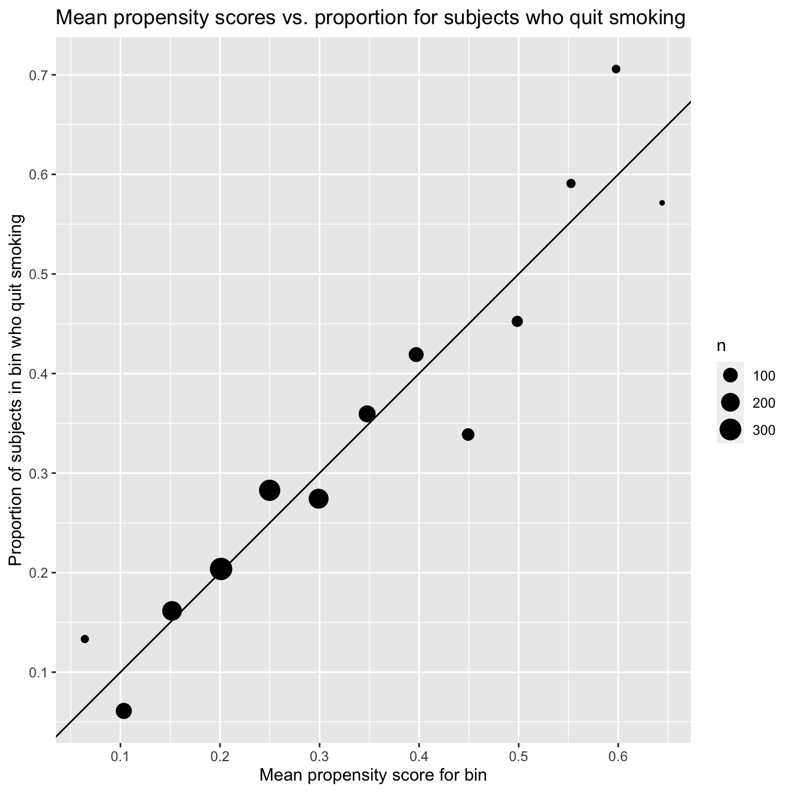

# 15 Outcome regression and propensity scores {-}


```r
# Packages
library(tidyverse)

# Parameters
  # NHEFS data
file_nhefs <- here::here("data/nhefs.rds")

# Round and format vector
round_format <- function(x, nsmall = 2, ...) {
  format(round(x, digits = nsmall), nsmall = nsmall, ...)
}
# Print tibble
kable <- function(x, cols = where(is.double), nsmall = 2, align = "r", ...) {
  x %>%
    mutate(across({{cols}}, round_format, nsmall = nsmall)) %>%
    knitr::kable(align = align, ...) %>% 
    kableExtra::kable_styling(full_width = FALSE, position = "left")
}

#===============================================================================

# NHEFS data
nhefs <- read_rds(file_nhefs)

# NHEFS censored for those with weight measurements in 1982
nhefs_censored <- 
  nhefs %>% 
  drop_na(wt82, wt82_71)
```

## 15.1 Outcome regression {-}

Fit linear regression using same model as in 13.2.


```r
fit <- 
  lm(
    wt82_71 ~ qsmk * smokeintensity + sex + poly(age, 2) + race + education +
      poly(wt71, 2) + I(smokeintensity^2) + poly(smokeyrs, 2) + active +
      exercise,
    data = nhefs_censored
  )

broom::tidy(fit)
```

```
#> # A tibble: 21 × 5
#>    term           estimate std.error statistic       p.value
#>    <chr>             <dbl>     <dbl>     <dbl>         <dbl>
#>  1 (Intercept)      1.67      0.903      1.85  0.0651       
#>  2 qsmk1            2.56      0.809      3.16  0.00159      
#>  3 smokeintensity   0.0491    0.0517     0.950 0.342        
#>  4 sex1            -1.43      0.469     -3.05  0.00233      
#>  5 poly(age, 2)1  -90.6      15.7       -5.76  0.00000000994
#>  6 poly(age, 2)2  -36.2      10.2       -3.53  0.000421     
#>  7 race1            0.560     0.582      0.963 0.336        
#>  8 education2       0.790     0.607      1.30  0.193        
#>  9 education3       0.556     0.556      1.00  0.317        
#> 10 education4       1.49      0.832      1.79  0.0733       
#> # … with 11 more rows
#> # ℹ Use `print(n = ...)` to see more rows
```

Estimates for coefficients of `qsmk1` and `qsmk1:smokeintensity`.


```r
broom::tidy(fit) %>% 
  filter(term %in% c("qsmk1", "qsmk1:smokeintensity")) %>% 
  select(term, estimate) %>% 
  kable(nsmall = 2, align = "lr")
```

<table class="table" style="width: auto !important; ">
 <thead>
  <tr>
   <th style="text-align:left;"> term </th>
   <th style="text-align:right;"> estimate </th>
  </tr>
 </thead>
<tbody>
  <tr>
   <td style="text-align:left;"> qsmk1 </td>
   <td style="text-align:right;"> 2.56 </td>
  </tr>
  <tr>
   <td style="text-align:left;"> qsmk1:smokeintensity </td>
   <td style="text-align:right;"> 0.05 </td>
  </tr>
</tbody>
</table>

Use `multcomp::glht()` to estimate ATE with 95% confidence interval.


```r
ate <- function(fit, contrast) {
  linfct <- matrix(0, ncol = length(coef(fit)))
  colnames(linfct) <- names(coef(fit))
  linfct[, names(contrast)] <- contrast
  
  multcomp::glht(fit, linfct = linfct) %>%
    broom::tidy(conf.int = TRUE) %>% 
    select(estimate, conf_low = conf.low, conf_high = conf.high)
}
```

Estimate ATE with 95% confidence interval for the effect of quitting smoking 5 cigarettes per day vs. not quitting.


```r
ate(fit, contrast = c(qsmk1 = 1, `qsmk1:smokeintensity` = 5)) %>%
  kable(nsmall = 1)
```

<table class="table" style="width: auto !important; ">
 <thead>
  <tr>
   <th style="text-align:right;"> estimate </th>
   <th style="text-align:right;"> conf_low </th>
   <th style="text-align:right;"> conf_high </th>
  </tr>
 </thead>
<tbody>
  <tr>
   <td style="text-align:right;"> 2.8 </td>
   <td style="text-align:right;"> 1.5 </td>
   <td style="text-align:right;"> 4.1 </td>
  </tr>
</tbody>
</table>

Estimate ATE with 95% confidence interval for the effect of quitting smoking 40 cigarettes per day vs. not quitting.


```r
ate(fit, contrast = c(qsmk1 = 1, `qsmk1:smokeintensity` = 40)) %>%
  kable(nsmall = 1)
```

<table class="table" style="width: auto !important; ">
 <thead>
  <tr>
   <th style="text-align:right;"> estimate </th>
   <th style="text-align:right;"> conf_low </th>
   <th style="text-align:right;"> conf_high </th>
  </tr>
 </thead>
<tbody>
  <tr>
   <td style="text-align:right;"> 4.4 </td>
   <td style="text-align:right;"> 2.8 </td>
   <td style="text-align:right;"> 6.1 </td>
  </tr>
</tbody>
</table>

Fit linear regression without product terms, the same model as in 13.3.


```r
fit <- 
  lm(
    wt82_71 ~ qsmk + sex + poly(age, 2) + race + education + poly(wt71, 2) +
      poly(smokeintensity, 2) + poly(smokeyrs, 2) + active + exercise,
    data = nhefs_censored
  )

broom::tidy(fit)
```

```
#> # A tibble: 20 × 5
#>    term          estimate std.error statistic  p.value
#>    <chr>            <dbl>     <dbl>     <dbl>    <dbl>
#>  1 (Intercept)      2.09      0.628     3.33  8.75e- 4
#>  2 qsmk1            3.46      0.438     7.90  5.36e-15
#>  3 sex1            -1.47      0.468    -3.13  1.79e- 3
#>  4 poly(age, 2)1  -90.7      15.7      -5.77  9.51e- 9
#>  5 poly(age, 2)2  -36.4      10.2      -3.56  3.89e- 4
#>  6 race1            0.586     0.582     1.01  3.14e- 1
#>  7 education2       0.819     0.607     1.35  1.78e- 1
#>  8 education3       0.572     0.556     1.03  3.04e- 1
#>  9 education4       1.51      0.832     1.81  7.01e- 2
#> 10 education5      -0.171     0.741    -0.230 8.18e- 1
#> # … with 10 more rows
#> # ℹ Use `print(n = ...)` to see more rows
```

Estimate of ATE with 95% confidence interval.


```r
v <- 
  broom::tidy(fit, conf.int = TRUE) %>% 
  filter(term == "qsmk1") %>% 
  select(estimate, conf_low = conf.low, conf_high = conf.high)

kable(v, nsmall = 1)
```

<table class="table" style="width: auto !important; ">
 <thead>
  <tr>
   <th style="text-align:right;"> estimate </th>
   <th style="text-align:right;"> conf_low </th>
   <th style="text-align:right;"> conf_high </th>
  </tr>
 </thead>
<tbody>
  <tr>
   <td style="text-align:right;"> 3.5 </td>
   <td style="text-align:right;"> 2.6 </td>
   <td style="text-align:right;"> 4.3 </td>
  </tr>
</tbody>
</table>


## 15.2 Propensity scores {-}

Fit logistic regression model for propensity scores.


```r
fit <- 
  glm(
    qsmk ~ sex + poly(age, 2) + race + education + poly(wt71, 2) + +
      poly(smokeintensity, 2) + poly(smokeyrs, 2) + active + exercise,
    family = binomial(),
    data = nhefs
  )

broom::tidy(fit)
```

```
#> # A tibble: 19 × 5
#>    term           estimate std.error statistic      p.value
#>    <chr>             <dbl>     <dbl>     <dbl>        <dbl>
#>  1 (Intercept)     -1.04       0.194   -5.35   0.0000000897
#>  2 sex1            -0.508      0.148   -3.42   0.000617    
#>  3 poly(age, 2)1   23.6        4.89     4.83   0.00000134  
#>  4 poly(age, 2)2   -3.76       3.15    -1.19   0.233       
#>  5 race1           -0.850      0.206   -4.13   0.0000363   
#>  6 education2      -0.0983     0.191   -0.516  0.606       
#>  7 education3       0.0157     0.171    0.0920 0.927       
#>  8 education4      -0.0425     0.264   -0.161  0.872       
#>  9 education5       0.380      0.220    1.72   0.0850      
#> 10 poly(wt71, 2)1   3.87       2.64     1.47   0.143       
#> # … with 9 more rows
#> # ℹ Use `print(n = ...)` to see more rows
```

Add propensity scores to data.


```r
nhefs <- 
  nhefs %>% 
  mutate(propensity = predict(fit, type = "response"))
```

Individuals with the lowest and highest propensity scores.


```r
nhefs %>% 
  select(seqn, propensity, qsmk) %>% 
  arrange(propensity) %>% 
  slice(1, n()) %>% 
  kable(nsmall = 3)
```

<table class="table" style="width: auto !important; ">
 <thead>
  <tr>
   <th style="text-align:right;"> seqn </th>
   <th style="text-align:right;"> propensity </th>
   <th style="text-align:right;"> qsmk </th>
  </tr>
 </thead>
<tbody>
  <tr>
   <td style="text-align:right;"> 22941 </td>
   <td style="text-align:right;"> 0.053 </td>
   <td style="text-align:right;"> 0 </td>
  </tr>
  <tr>
   <td style="text-align:right;"> 24949 </td>
   <td style="text-align:right;"> 0.793 </td>
   <td style="text-align:right;"> 1 </td>
  </tr>
</tbody>
</table>

Consistent with their propensity scores, individual 22941 did not quit smoking and individual 24949 did.

Distribution of propensity scores for non-quitters and quitters.


```r
qsmk_labels <- c("0" = "Non-quitters", "1" = "Quitters")

means <- 
  nhefs %>% 
  group_by(qsmk) %>% 
  summarize(propensity_mean = mean(propensity))

nhefs %>% 
  ggplot(aes(propensity)) +
  geom_histogram(binwidth = 0.05, boundary = 0.025) +
  geom_vline(aes(xintercept = propensity_mean), data = means, color = "red") +
  scale_x_continuous(breaks = scales::breaks_width(0.1)) +
  facet_grid(rows = vars(qsmk), labeller = labeller(qsmk = qsmk_labels)) +
  labs(
    title = "Distribution of propensity scores for non-quitters and quitters",
    subtitle = "Red lines indicate mean propensity score for group",
    x = "Propensity score",
    y = "Number of subjects"
  )
```


Mean propensity score for group.


```r
kable(means, nsmall = 3)
```

<table class="table" style="width: auto !important; ">
 <thead>
  <tr>
   <th style="text-align:right;"> qsmk </th>
   <th style="text-align:right;"> propensity_mean </th>
  </tr>
 </thead>
<tbody>
  <tr>
   <td style="text-align:right;"> 0 </td>
   <td style="text-align:right;"> 0.245 </td>
  </tr>
  <tr>
   <td style="text-align:right;"> 1 </td>
   <td style="text-align:right;"> 0.312 </td>
  </tr>
</tbody>
</table>

As expected, those who did not quit smoking had, on average, a lower estimated probability of quitting (0.245) than those who did quit (0.312).

Mean propensity scores vs. proportion for subjects who quit smoking.


```r
v <- 
  nhefs %>% 
  group_by(bin = cut_width(propensity, width = 0.05, boundary = 0.025)) %>% 
  summarize(
    propensity_mean = mean(propensity),
    qsmk_mean = mean(as.double(qsmk) - 1),
    n = n()
  ) %>% 
  filter(n > 1)

v %>% 
  ggplot(aes(propensity_mean, qsmk_mean, size = n)) +
  geom_point() +
  geom_abline() +
  scale_x_continuous(breaks = scales::breaks_width(0.1)) +
  scale_y_continuous(breaks = scales::breaks_width(0.1)) +
  coord_fixed() +
  labs(
    title = 
      "Mean propensity scores vs. proportion for subjects who quit smoking",
    x = "Mean propensity score for bin",
    y = "Proportion of subjects in bin who quit smoking"
  )
```



For the bins in the histogram, this plot shows that the mean propensity score for each bin is fairly close to the actual proportion of subjects in the bin who quit smoking.

## 15.3 Propensity stratification and standardization {-}

Individual 22005 is the only person with a propensity score near 0.6563.


```r
nhefs %>% 
  filter(near(propensity, 0.6563, tol = 0.0001)) %>% 
  select(seqn, propensity) %>% 
  kable(nsmall = 4)
```

<table class="table" style="width: auto !important; ">
 <thead>
  <tr>
   <th style="text-align:right;"> seqn </th>
   <th style="text-align:right;"> propensity </th>
  </tr>
 </thead>
<tbody>
  <tr>
   <td style="text-align:right;"> 22005 </td>
   <td style="text-align:right;"> 0.6563 </td>
  </tr>
</tbody>
</table>

Add column for propensity score deciles.


```r
nhefs <- 
  nhefs %>% 
  arrange(propensity, seqn) %>% 
  mutate(
    decile = cut_number(propensity, n = 10, labels = FALSE) %>% as.factor()
  ) %>% 
  arrange(seqn)
```

Number of individuals in each decile.


```r
nhefs %>% 
  count(decile) %>% 
  kable()
```

<table class="table" style="width: auto !important; ">
 <thead>
  <tr>
   <th style="text-align:right;"> decile </th>
   <th style="text-align:right;"> n </th>
  </tr>
 </thead>
<tbody>
  <tr>
   <td style="text-align:right;"> 1 </td>
   <td style="text-align:right;"> 163 </td>
  </tr>
  <tr>
   <td style="text-align:right;"> 2 </td>
   <td style="text-align:right;"> 163 </td>
  </tr>
  <tr>
   <td style="text-align:right;"> 3 </td>
   <td style="text-align:right;"> 163 </td>
  </tr>
  <tr>
   <td style="text-align:right;"> 4 </td>
   <td style="text-align:right;"> 163 </td>
  </tr>
  <tr>
   <td style="text-align:right;"> 5 </td>
   <td style="text-align:right;"> 163 </td>
  </tr>
  <tr>
   <td style="text-align:right;"> 6 </td>
   <td style="text-align:right;"> 162 </td>
  </tr>
  <tr>
   <td style="text-align:right;"> 7 </td>
   <td style="text-align:right;"> 163 </td>
  </tr>
  <tr>
   <td style="text-align:right;"> 8 </td>
   <td style="text-align:right;"> 163 </td>
  </tr>
  <tr>
   <td style="text-align:right;"> 9 </td>
   <td style="text-align:right;"> 163 </td>
  </tr>
  <tr>
   <td style="text-align:right;"> 10 </td>
   <td style="text-align:right;"> 163 </td>
  </tr>
</tbody>
</table>

Fit linear regression with decile interaction.


```r
fit <- lm(wt82_71 ~ qsmk * decile, data = nhefs)

broom::tidy(fit)
```

```
#> # A tibble: 20 × 5
#>    term        estimate std.error statistic  p.value
#>    <chr>          <dbl>     <dbl>     <dbl>    <dbl>
#>  1 (Intercept)   4.00       0.630   6.34    3.04e-10
#>  2 qsmk1        -0.0147     2.39   -0.00613 9.95e- 1
#>  3 decile2      -1.09       0.916  -1.19    2.34e- 1
#>  4 decile3      -1.38       0.918  -1.51    1.32e- 1
#>  5 decile4      -0.521      0.926  -0.562   5.74e- 1
#>  6 decile5      -1.90       0.940  -2.02    4.39e- 2
#>  7 decile6      -2.15       0.954  -2.25    2.44e- 2
#>  8 decile7      -2.44       0.949  -2.57    1.04e- 2
#>  9 decile8      -3.71       0.974  -3.81    1.44e- 4
#> 10 decile9      -4.89       1.03   -4.73    2.44e- 6
#> # … with 10 more rows
#> # ℹ Use `print(n = ...)` to see more rows
```

Estimate ATE with 95% confidence interval for decile.


```r
ate <- function(fit, decile) {
  if (decile == 1) {
    contrast <- c(qsmk1 = 1)
  } else {
    contrast <- c(1, 1)
    names(contrast) <- c("qsmk1", str_c("qsmk1:decile", decile))
  }
  linfct <- matrix(0, ncol = length(coef(fit)))
  colnames(linfct) <- names(coef(fit))
  linfct[, names(contrast)] <- contrast
  
  multcomp::glht(fit, linfct = linfct) %>%
    broom::tidy(conf.int = TRUE) %>% 
    select(estimate, conf_low = conf.low, conf_high = conf.high) %>% 
    add_column(decile, .before = "estimate")
}
```

Estimates of ATE with 95% confidence intervals for all deciles.


```r
ate_decile <- 
  1:10 %>% 
  map_dfr(~ ate(fit, decile = .)) %>% 
  mutate(across(decile, as.factor))

ate_decile %>% 
  kable(nsmall = 1)
```

<table class="table" style="width: auto !important; ">
 <thead>
  <tr>
   <th style="text-align:right;"> decile </th>
   <th style="text-align:right;"> estimate </th>
   <th style="text-align:right;"> conf_low </th>
   <th style="text-align:right;"> conf_high </th>
  </tr>
 </thead>
<tbody>
  <tr>
   <td style="text-align:right;"> 1 </td>
   <td style="text-align:right;"> 0.0 </td>
   <td style="text-align:right;"> -4.7 </td>
   <td style="text-align:right;"> 4.7 </td>
  </tr>
  <tr>
   <td style="text-align:right;"> 2 </td>
   <td style="text-align:right;"> 4.1 </td>
   <td style="text-align:right;"> 0.9 </td>
   <td style="text-align:right;"> 7.4 </td>
  </tr>
  <tr>
   <td style="text-align:right;"> 3 </td>
   <td style="text-align:right;"> 6.5 </td>
   <td style="text-align:right;"> 3.4 </td>
   <td style="text-align:right;"> 9.7 </td>
  </tr>
  <tr>
   <td style="text-align:right;"> 4 </td>
   <td style="text-align:right;"> 2.3 </td>
   <td style="text-align:right;"> -0.6 </td>
   <td style="text-align:right;"> 5.2 </td>
  </tr>
  <tr>
   <td style="text-align:right;"> 5 </td>
   <td style="text-align:right;"> 4.1 </td>
   <td style="text-align:right;"> 1.4 </td>
   <td style="text-align:right;"> 6.8 </td>
  </tr>
  <tr>
   <td style="text-align:right;"> 6 </td>
   <td style="text-align:right;"> 4.5 </td>
   <td style="text-align:right;"> 1.8 </td>
   <td style="text-align:right;"> 7.2 </td>
  </tr>
  <tr>
   <td style="text-align:right;"> 7 </td>
   <td style="text-align:right;"> 4.3 </td>
   <td style="text-align:right;"> 1.5 </td>
   <td style="text-align:right;"> 7.1 </td>
  </tr>
  <tr>
   <td style="text-align:right;"> 8 </td>
   <td style="text-align:right;"> 3.6 </td>
   <td style="text-align:right;"> 0.9 </td>
   <td style="text-align:right;"> 6.2 </td>
  </tr>
  <tr>
   <td style="text-align:right;"> 9 </td>
   <td style="text-align:right;"> 2.3 </td>
   <td style="text-align:right;"> -0.2 </td>
   <td style="text-align:right;"> 4.8 </td>
  </tr>
  <tr>
   <td style="text-align:right;"> 10 </td>
   <td style="text-align:right;"> 2.2 </td>
   <td style="text-align:right;"> -0.2 </td>
   <td style="text-align:right;"> 4.7 </td>
  </tr>
</tbody>
</table>

Estimated average treatment effect for each propensity score decile.


```r
v <- 
  nhefs %>% 
  group_by(decile) %>% 
  summarize(propensity_mean = mean(propensity)) %>% 
  left_join(ate_decile, by = "decile")

v %>% 
  ggplot(aes(propensity_mean, estimate)) +
  geom_pointrange(aes(ymin = conf_low, ymax = conf_high)) +
  labs(
    title = 
      "Estimated average treatment effect for each propensity score decile",
    subtitle = "Range indicates 95% confidence interval",
    x = "Mean propensity score for decile",
    y = "Estimated average treatment effect for decile (kg)"
  )
```


Fit linear regression without decile interaction.


```r
fit <- lm(wt82_71 ~ qsmk + decile, data = nhefs)

broom::tidy(fit)
```

```
#> # A tibble: 11 × 5
#>    term        estimate std.error statistic  p.value
#>    <chr>          <dbl>     <dbl>     <dbl>    <dbl>
#>  1 (Intercept)    3.75      0.609     6.16  9.29e-10
#>  2 qsmk1          3.50      0.457     7.66  3.28e-14
#>  3 decile2       -0.739     0.861    -0.858 3.91e- 1
#>  4 decile3       -0.618     0.861    -0.718 4.73e- 1
#>  5 decile4       -0.520     0.858    -0.606 5.44e- 1
#>  6 decile5       -1.49      0.859    -1.73  8.34e- 2
#>  7 decile6       -1.62      0.868    -1.87  6.16e- 2
#>  8 decile7       -1.99      0.868    -2.29  2.23e- 2
#>  9 decile8       -3.44      0.875    -3.94  8.61e- 5
#> 10 decile9       -5.15      0.885    -5.83  6.91e- 9
#> # … with 1 more row
#> # ℹ Use `print(n = ...)` to see more rows
```

Propensity score stratification - Decile: estimate of ATE with 95% confidence interval.


```r
v <-
  broom::tidy(fit, conf.int = TRUE) %>% 
  filter(term == "qsmk1") %>% 
  select(estimate, conf_low = conf.low, conf_high = conf.high)

kable(v, nsmall = 1)
```

<table class="table" style="width: auto !important; ">
 <thead>
  <tr>
   <th style="text-align:right;"> estimate </th>
   <th style="text-align:right;"> conf_low </th>
   <th style="text-align:right;"> conf_high </th>
  </tr>
 </thead>
<tbody>
  <tr>
   <td style="text-align:right;"> 3.5 </td>
   <td style="text-align:right;"> 2.6 </td>
   <td style="text-align:right;"> 4.4 </td>
  </tr>
</tbody>
</table>


Fit linear regression with continuous propensity score.


```r
fit <- lm(wt82_71 ~ qsmk + propensity, data = nhefs)

broom::tidy(fit)
```

```
#> # A tibble: 3 × 5
#>   term        estimate std.error statistic  p.value
#>   <chr>          <dbl>     <dbl>     <dbl>    <dbl>
#> 1 (Intercept)     5.59     0.483     11.6  8.16e-30
#> 2 qsmk1           3.55     0.457      7.76 1.47e-14
#> 3 propensity    -14.8      1.76      -8.43 7.55e-17
```

Propensity score stratification - Continuous: estimate of ATE with 95% confidence interval.


```r
v <-
  broom::tidy(fit, conf.int = TRUE) %>% 
  filter(term == "qsmk1") %>% 
  select(estimate, conf_low = conf.low, conf_high = conf.high)

kable(v, nsmall = 1)
```

<table class="table" style="width: auto !important; ">
 <thead>
  <tr>
   <th style="text-align:right;"> estimate </th>
   <th style="text-align:right;"> conf_low </th>
   <th style="text-align:right;"> conf_high </th>
  </tr>
 </thead>
<tbody>
  <tr>
   <td style="text-align:right;"> 3.6 </td>
   <td style="text-align:right;"> 2.7 </td>
   <td style="text-align:right;"> 4.4 </td>
  </tr>
</tbody>
</table>


Data with values for `wt82_71`.


```r
nhefs_censored <- 
  nhefs %>% 
  drop_na(wt82_71)
```

ATE using fit on sample of data.


```r
ate <- function(data, sample_rows) {
  fit <- lm(wt82_71 ~ qsmk + propensity, data = data %>% slice(sample_rows))
  
  mean(predict(fit, newdata = nhefs %>% mutate(qsmk = "1"))) -
    mean(predict(fit, newdata = nhefs %>% mutate(qsmk = "0")))
}
```

Estimate of ATE.


```r
estimate <- ate(data = nhefs_censored, sample_rows = 1:nrow(nhefs_censored))

tibble(estimate) %>% 
  kable(nsmall = 1)
```

<table class="table" style="width: auto !important; ">
 <thead>
  <tr>
   <th style="text-align:right;"> estimate </th>
  </tr>
 </thead>
<tbody>
  <tr>
   <td style="text-align:right;"> 3.6 </td>
  </tr>
</tbody>
</table>

We will now use bootstrapping to obtain a confidence interval for this estimate.

Perform bootstrap resampling.


```r
set.seed(231)

n_boot <- 1e4

boot_out <- boot::boot(data = nhefs_censored, statistic = ate, R = n_boot)
```

Distribution of average treatment effect.


```r
tibble(ate = boot_out$t) %>% 
  ggplot(aes(ate)) +
  geom_histogram(binwidth = 0.1, boundary = 0) +
  labs(
    title = "Distribution of average treatment effect",
    x = "Average treatment effect",
    y = "Count"
  )
```


Propensity score standardization: estimate of ATE with 95% confidence interval. Confidence interval calculated using bias-corrected and accelerated (BCa) method.


```r
v <- 
  broom::tidy(boot_out, conf.int = TRUE, conf.method = "bca") %>% 
  transmute(estimate, conf_low = conf.low, conf_high = conf.high)

kable(v, nsmall = 1)
```

<table class="table" style="width: auto !important; ">
 <thead>
  <tr>
   <th style="text-align:right;"> estimate </th>
   <th style="text-align:right;"> conf_low </th>
   <th style="text-align:right;"> conf_high </th>
  </tr>
 </thead>
<tbody>
  <tr>
   <td style="text-align:right;"> 3.6 </td>
   <td style="text-align:right;"> 2.6 </td>
   <td style="text-align:right;"> 4.5 </td>
  </tr>
</tbody>
</table>


